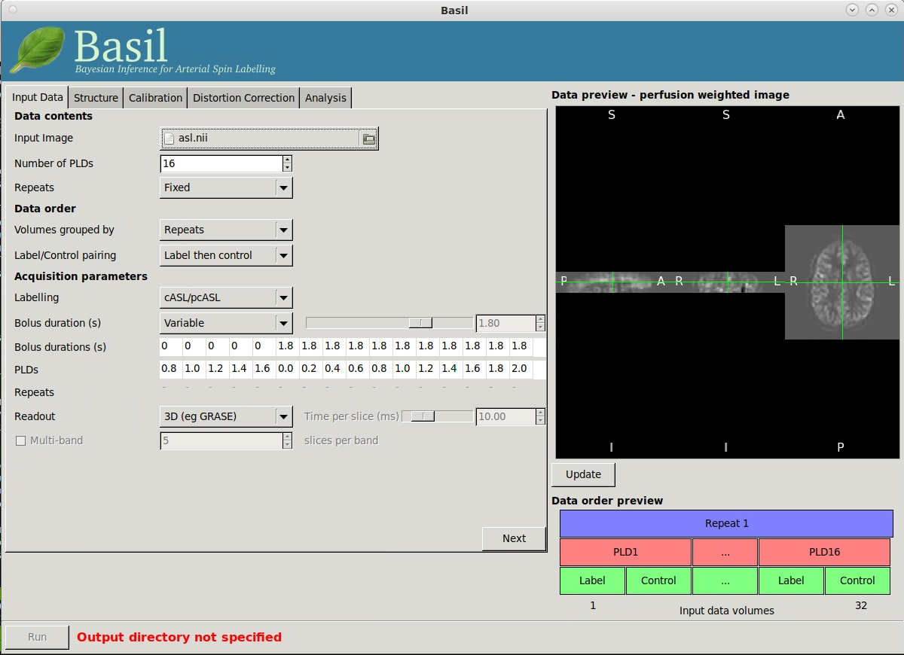
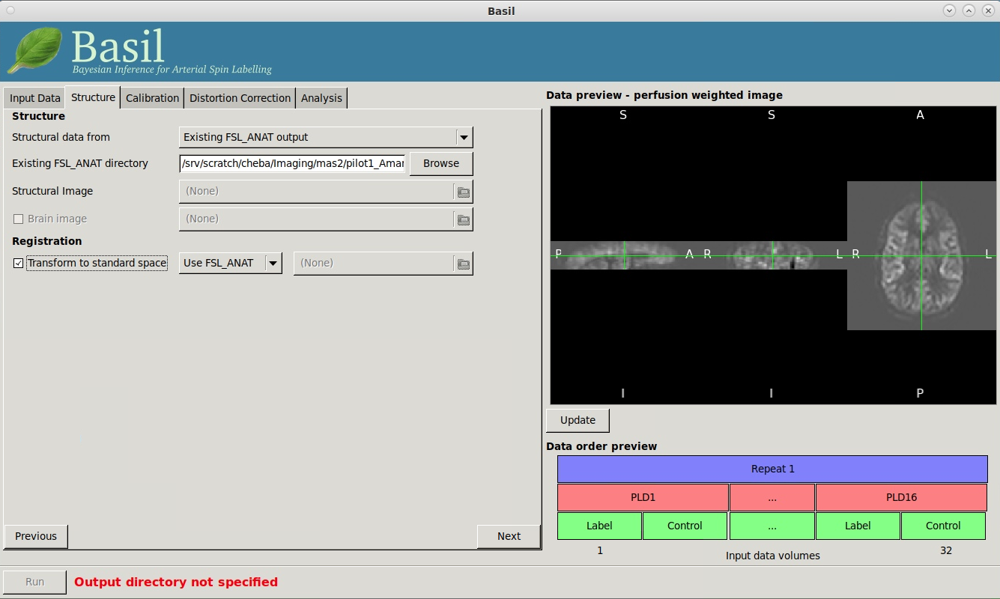
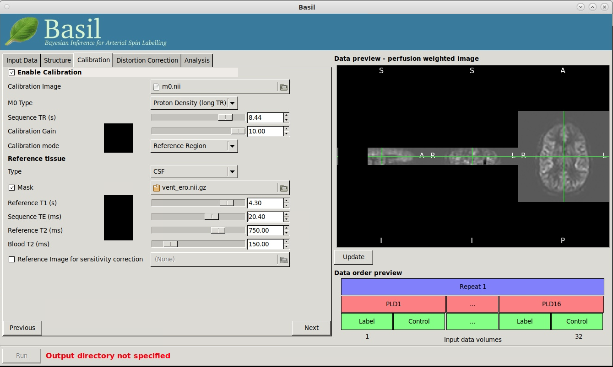
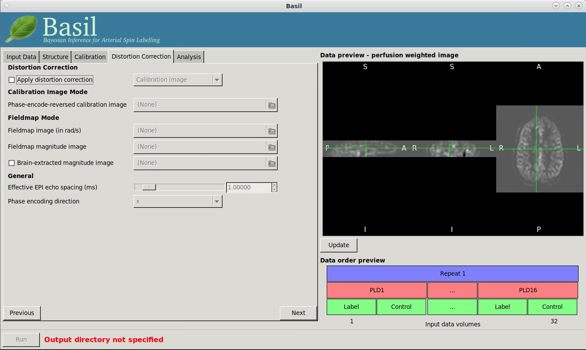
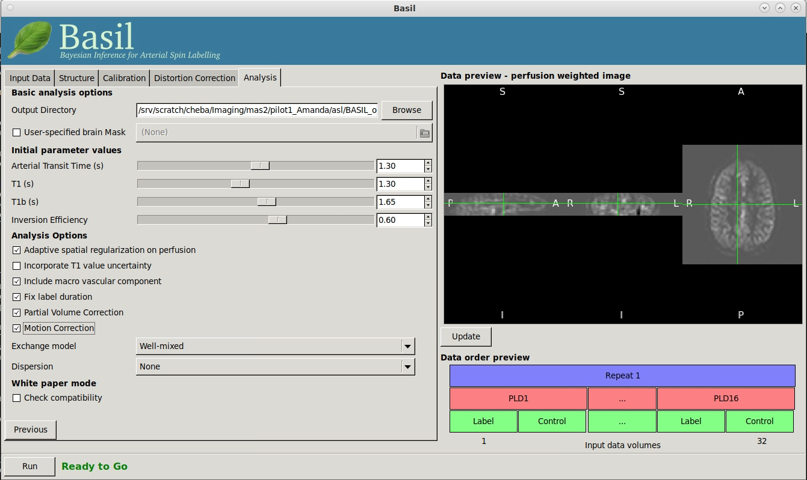

Arterial spin labelling (ASL)
=============================

Single PLD ASL data from OATS 4 Sydney and SCS using BASIL GUI
--------------------------------------------------------------
Older Australian Twins Study (OATS) and Sydney Centenarians Study (SCS) have acquired pulsed and pseudo-continuous ASL data. This section details the settings on BASIL GUI for processing these data.

Refer to `BASIL website <https://asl-docs.readthedocs.io/en/latest/>`_ for full content.

Before we go to BASIL GUI
~~~~~~~~~~~~~~~~~~~~~~~~~
- **Run fsl_anat on T1 images**: For example, ``for_each -nthreads 8 /srv/scratch/cheba/Imaging/ow4sydAndScsAsl/1* : fsl_anat -i IN/t1 -o IN/t1``. *for_each* is `a MRtrix command for parallel computing <https://mrtrix.readthedocs.io/en/latest/tips_and_tricks/batch_processing_with_foreach.html>`_. It is useful to run commands parallelly on local computer/workstation.
- For OATS Wave 3 Melbourne and Brisbane data (i.e., pulsed ASL from Siemens), the first of the 101 PASL volumes should be extracted and used as M0 image, and the rest should be considered as tag/control pairs. *fslroi* can be used for this.
- **Segment lateral ventricles**: Run <code>/path/to/BrainMRIpipelines/misc/bmp_misc_getLatVent.m</code> to extract lateral ventricular mask for calibration. For example 

..  code-block::

    # Create 'ventricle' folder to keep intermediate files
    for_each -nthreads 8 /srv/scratch/cheba/Imaging/ow4sydAndScsAsl/1* : mkdir -p IN/ventricle

    # Extract lateral ventricles
    for_each -nthreads 8 /srv/scratch/cheba/Imaging/ow4sydAndScsAsl/1* : matlab -nodesktop -nodisplay -r \"addpath\(fullfile\(getenv\(\'BMP_PATH\'\),\'misc\'\)\)\;bmp_misc_getLatVent\(\'IN/m0.nii\',\'IN/t1.nii\',\'IN/ventricle\'\)\;exit\"

    # Copy ventricular mask to the same folder as asl/m0/t1
    for_each -nthreads 8 /srv/scratch/cheba/Imaging/ow4sydAndScsAsl/1* : cp IN/ventricle/rventricular_mask.nii IN/vent.nii

    # Erode ventricular masks - ventricular reference masks should be conservative
    for_each -nthreads 8 /srv/scratch/cheba/Imaging/ow4sydAndScsAsl/1* : fslmaths IN/vent -kernel boxv 2 -ero IN/vent_ero

"Input Data" tab
~~~~~~~~~~~~~~~~~

"Data contents" section
+++++++++++++++++++++++
- **Input Image** is the image containing tag-control pairs, or subtracted images between each tag-control pair, in the 4th dimension.
- **Number of PLDs**: set to 1, because OATS and SCS acquired single-PLD ASL data.
- **Repeats**: leave as Fixed.

"Data order" section
++++++++++++++++++++
- **Volumes grouped by** option is to specify how data were acquired in *multi-PLD* data. For single-PLD data, select Repeats.
- **Label/Control Pairing** specifies the order of label/control (i.e., label then control, or control then label). See `ASL parameter table`_.

"Acquisition parameters" section
++++++++++++++++++++++++++++++++
- **Labelling**: choose corresponding ASL flavour according to `ASL parameter table`_.
- **Bolus duration (s)**: use the numbers in the `ASL parameter table`_.
- **PLDs**: use the numbers in the `ASL parameter table`_. PLD = TI - bolus duration.
- **Readout**: OATS and SCS used 2D readouts. Therefore, select *2D multi-slice (eg EPI)*.
- **Time per slice (ms)**: Use numbers in the `ASL parameter table`_.
- **Multi-band**: Untick as OATS and SCS didn't use multiband.

"Structure" tab
~~~~~~~~~~~~~~~

"Structure" section
+++++++++++++++++++
- **Structural data from**: Choose *Existing FSL_ANAT output*.
- **Existing FSL_ANAT directory**: Use *Browse* to specify */path/to/fsl_anat/output*.

"Registration" section
++++++++++++++++++++++
- **Transform to standard space**: Tick, and select *Use FSL_ANAT*. This can be useful for applying templates and extracting regional CBF.

"Calibration" tab
~~~~~~~~~~~~~~~~~

"Enable Calibration" section
++++++++++++++++++++++++++++
- **Enable calibration**: *Tick* to enable calibration.
- **Calibration image**: Select the corresponding M0 map.
- **M0 Type**: *Proton Density (long TR)*. See references_.
- **Sequence TR (s)**: Refer to *TR of M0* in the `ASL parameter table`_.
- **Calibration Gain**: Set to 1. A few FSL email threads suggest calibration gain of 10 is a good number to start with for ASL tag/control pairs acquired with background suppression (see references_). However, this leads to abnormally low CBF (~ 2-3) in examples if OATS Wave 4 Sydney data. After experiments, it seems setting the gain to 1 gives reasonable CBF estimates.
- **Calibration mode**: Choose *Reference Region* (Note this is not compliant with White paper, but in many casese voxelwise and reference mask methods are equivalent).

"Reference tissue" section
++++++++++++++++++++++++++++
- **Type**: Choose *CSF*.
- **Mask**: *Tick*, and select the ventricular mask generated in "Before we go to GUI" section. Try both full and eroded ventricular masks. In theory, reference masks should be conservative. The only concern may be an empty mask after erosion. So it is a good idea to visualise eroded masks.
- **Sequence TE (ms)**: Refer to *TE of both M0 and tag/control* in the `ASL parameter table`_.
- **Reference T1 (s), Reference T2 (ms), and Blood T2 (ms)**: Leave them as default values.
- **Reference image for sensitiviey correction**: untick.

"Distortion Correction" tab
~~~~~~~~~~~~~~~~~~~~~~~~~~~
- *untick* 'Apply distortion correction', as no additional images for distortion correction of ASL/M0 were acquired in OATS or SCS.
- Click *Next* to ignore distortion correction for now. Also see `Future work`_ below.

"Analysis" tab
~~~~~~~~~~~~~~
"Basic analysis options" section
++++++++++++++++++++++++++++++++
- **Output Derectory**: Path to save output.
- **User-specified brain mask**: *Untick* to let BASIL create brain mask. Also see `Future work`_ below.

"Initial parameter values" section
++++++++++++++++++++++++++++++++++
- **Arterial Transit Time (s)**: For pulsed ASL data (OATS Wave 3 Melbourne and Brisbane), set Arterial Transit Time to 0.7 sec. For pseudo-continuous ASL data (OATS Wave 4 Sydney and SCS), set Arterial Transit Time to 1.3 sec. Note that *white paper mode* will reset this Arterial Transit Time to 0.
- **T1 (s)**: T1 for tissue. Use default 1.3 sec. Note that *white paper mode* will set this T1 for tissue to 1.65 sec.
- **T1b (s)**: T1 for blood. Use default 1.65 sec. *white paper mode* will also set this T1 for blood to 1.3 sec.
- **Inversion Efficiency**: 0.85 for pseudo-continuous ASL (OATS Wave 4 Sydney and SCS), and 0.98 for pulsed ASL (OATS Wave 3 Melbourne and Brisbane). These values were taken from white paper.

"Analysis options" section
++++++++++++++++++++++++++
- **Adaptive spatial regularisation on perfusion**: *tick*. This option applies a spatial prior to the perfusion image during estimation, thus making use of neighbourhood information. This is strongly recommended.
- **Incorporate T1 uncertainty**: *untick*. This option permits voxelwise variability in the T1 values, this will primiarly be reflected in the variance images for the estimated parameters, don't expect accurate T1 maps from conventional ASL data.
- **Include macro vascular component**: *untick*. This option corrects for arterial or macrovascular contamination, and it suits where the data have multi-PLD (even where flow suppresion has been applied). Untick because OATS and SCS ASL data are single PLD.
- **Fix label duration**: *tick* for psudo-continuous ASL data (OATS Wave 4 Sydney and SCS). *untick* for pulsed ASL data (OATS Wave 3 Melbourne and Brisbane). This option takes the value for the label duration from the Input Data tab as fixed, turn off to estimate this from the data (the value on the data tab will be used as prior information in that case). You are most likely to want to deselect the option for pASL data, particularly where QUIPSSII/Q2TIPS has not been used to fix the label duration.
- **Partial Volume Correction**: *tick*. This option correct for the different contributions from GM, WM and CSF to the perfusion image. This will produce separate grey and white matter perfusion maps.
- **Motion Correction**: *tick*. This option uses *mcflirt* to perform motion correction of ASL data (and the calibration image).
- **Exchange/Dispersion model**: Leave as default.

"White paper mode" section
++++++++++++++++++++++++++
- **Check compatibility**: *untick* to run with the options/parameters set above. Can then *tick*, *View issues*, and *Make compatible* to run in white paper mode and compare with previous results.

Command line
~~~~~~~~~~~~
The above settings translate to below command for an OATS Wave 4 Sydney (pseudo-continuous ASL) example. This can be used to prepare scripts for batch processing.

.. code-block::

   oxford_asl -i /srv/scratch/cheba/Imaging/ow4sydAndScsAsl/test/12301/asl.nii --iaf ct --ibf rpt --casl --bolus 1.8 --rpts 30 --slicedt 0.03531 --tis 3.8 --fslanat /srv/scratch/cheba/Imaging/ow4sydAndScsAsl/test/12301/t1.anat -c /srv/scratch/cheba/Imaging/ow4sydAndScsAsl/test/12301/m0.nii --cmethod single --tr 6 --cgain 1 --tissref csf --csf /srv/scratch/cheba/Imaging/ow4sydAndScsAsl/test/12301/vent.nii --t1csf 4.3 --t2csf 750 --t2bl 150 --te 12 -o /srv/scratch/cheba/Imaging/ow4sydAndScsAsl/test/12301/basil_output --bat 1.3 --t1 1.3 --t1b 1.65 --alpha 0.85 --spatial --fixbolus --mc --pvcorr --artoff

Expected outputs
~~~~~~~~~~~~~~~~
- *perfusion.nii.gz*: Perfusion image providing blood flow in relative (scanner) units.
- *perfusion_calib.nii.gz*: Calibrated perfusion image providing blood flow in absolute units (ml/100g/min).
- Results in *native ASL*, *structural*, and *standard space* will appear in the output directory within separate subdirectories.
- Summary measures of perfusion will be available in *native_space* subdirectory.
- *M0.txt* in *calib* subdirectory: The estimated M0 value from arterial blood.
- *refmask.nii.gz* in *calib* subdirectory: Reference tissue mask for calibration.

Quality control
~~~~~~~~~~~~~~~
- In the BASIL GUI, after loading ASL tag/control pairs and clicking *Update* in the data preview, you should see a pattern of higher intensities in GM than WM, corresponding to higher perfusion in GM than WM.
- Whole brain average CBF is normally lower than 60, typically 30-40 (`ref <https://www.jiscmail.ac.uk/cgi-bin/wa-jisc.exe?A2=ind1408&L=FSL&P=R86444>`_).
- Whole brain GM CBF (if you are looking at native_space subdirectory at perfusion_calib_gm_mean.txt) should be in the range of 30-50. If you are looking at partial volume corrected results the equivalent value should be a bit higher, reflecting the correction that has been done. (`ref <https://www.jiscmail.ac.uk/cgi-bin/wa-jisc.exe?A2=ind2004&L=FSL&P=R91652>`_). White paper advises that GM CBF should be anywhere between 40-100 for healthy adult controls (not elderly).
- Whole brain WM CBF (perfusion_calib_wm_mean.txt in native_space subdirectory) should be in the range of 10-20 (`ref <https://www.jiscmail.ac.uk/cgi-bin/wa-jisc.exe?A2=ind2004&L=FSL&P=R91652>`_).
- If you are examining images, then WM CBF should be of clearly lower intensity than GM CBF.
- Refernce tissue mask (*refmask.nii.gz* in *calib* subdirectory) should be a conservative lateral ventricular CSF mask of M0 image.

.. _ASL parameter table:

ASL parameters
~~~~~~~~~~~~~~
+------------------------------------------------+--------------------------------------+------------------------------+
| **Study**                                      | **OATS Wave 3 Melbourne & Brisbane** | **OATS Wave 4 Sydney & SCS** |
+------------------------------------------------+--------------------------------------+------------------------------+
| **ASL flavour**                                | 2D pulsed ASL                        | 2D pseudo-continuous ASL     |
+------------------------------------------------+--------------------------------------+------------------------------+
| **TI**                                         | 1.8 sec                              | 3.8 sec                      |
+------------------------------------------------+--------------------------------------+------------------------------+
| **Bolus duration**                             | 0.7 sec                              | 1.8 sec                      |
+------------------------------------------------+--------------------------------------+------------------------------+
| **Post-labelling delay (TI - bolus duration)** | 1.1 sec                              | 2.0 sec                      |
+------------------------------------------------+--------------------------------------+------------------------------+
| **Bolus arrival time**                         | 0.7 sec                              | 1.3 sec                      |
+------------------------------------------------+--------------------------------------+------------------------------+
| **Time per slice (slicedt)**                   | 46.67 msec                           | 35.31 msec                   |
+------------------------------------------------+--------------------------------------+------------------------------+
| **Multi-band**                                 | No                                   | No                           |
+------------------------------------------------+--------------------------------------+------------------------------+
| **TR of tag/control pairs**                    | 2.5 sec                              | 4.5 sec                      |
+------------------------------------------------+--------------------------------------+------------------------------+
| **TR of M0**                                   | 2.5 sec                              | 6 sec                        |
+------------------------------------------------+--------------------------------------+------------------------------+
| **TE of both M0 and tag/control**              | 11 msec                              | 12 msec                      |
+------------------------------------------------+--------------------------------------+------------------------------+
| **tag/control order**                          | tag then control                     | control then tag             |
+------------------------------------------------+--------------------------------------+------------------------------+
| **M0 type**                                    | Proton Density (long TR)             | Proton Density (long TR)     |
+------------------------------------------------+--------------------------------------+------------------------------+
| **Calibration gain**                           | 1?                                   | 1                            |
+------------------------------------------------+--------------------------------------+------------------------------+

Other imaging parameters described in `a previous publication <https://www.frontiersin.org/articles/10.3389/fnagi.2019.00169/full>`_. Note that SCS has identical parameters as OATS New South Wales site.

   *New South Wales Site*: PCASL scans were acquired using a Philips 3T Achieva Quasar Dual scanner (Philips Medical Systems, Netherlands). The acquisition parameters were TR/TE = 4,500/12 ms, label duration = 1,800 ms, post label delay = 2,000 ms, flip angle = 90°, imaging matrix = 128 × 128, and FOV = 240 × 240 × 95 mm3. Sixteen slices with slice thickness of 5 mm and 1 mm gap between adjacent slices were acquired. Thirty control-tag pairs (i.e., 60 volumes) were scanned, with background suppression enabled. A separate M0 image without background suppression was also acquired with TR/TE = 6,000/12 ms and the same spatial resolution as the 30 control-tag pairs. T1-weighted scans were also acquired for the postprocessing. The scanning parameters were TR/TE = 6.5/3.0 ms, flip angle = 8°, FOV = 250 × 250 × 190 mm3, spatial resolution = 1 mm isotrophic, and matrix size = 256 × 256.

   *Victoria and Queensland Sites*: Both Victoria and Queensland study centers have used the same scanner model and identical scanning parameters for ASL and T1. At both sites, PASL scans were acquired from 3T Siemens Magnetom Trio scanners, using the PICORE Q2T perfusion mode. The acquisition parameters were TR/TE = 2,500/11 ms, TI1/TI2 = 700/1,800 ms, flip angle = 90°, phase partial Fourier factor = 7/8, bandwidth = 2232 Hz/pix, imaging matrix = 64 × 64, and FOV = 192 mm. Eleven sequential 6-mm thick slices with a distance factor (i.e., gap) of 25% between adjacent slices were acquired for each volume. The first of the 101 PASL volumes was used as the M0 image. T1-weighted images were acquired in Victoria and Queensland sites with TR/TE/TI = 2,300/2.98/900 ms, flip angle = 9°, 208 sagittal slices, within plane FOV = 256 × 240 mm2, voxel size = 1 × 1 × 1 mm3, and bandwidth = 240 Hz/pix.

.. _future work:

Future work
~~~~~~~~~~~
- To confirm whether OATS Wave 4 Melbourne has the same parameters as OATS Wave 3 Melbourne and Brisbane.
- To confirm calibration gain of 1 for OATS Wave 3 Melbourne and Brisbane (i.e., no background suppression).
- "Distortion correction" tab: Can Synb0-DISCO be used to correct for distortion?
- "Analysis" tab: Compare BASIL-generated brain mask with MRtrix's dwi2mask and T1 brain mask from fsl_anat.

Known issues
~~~~~~~~~~~~
- It seems when running *asl_calib* to calibrate with CSF as reference, a warning of "*WARNING:: Inconsistent orientations for individual images in pipeline. Will use voxel-based orientation which is probably incorrect - \*PLEASE CHECK\*!*" will appear. Have had a look at ventricular mask superimposed on M0 map, and found no issue.
- Notice that since automated cropping was conducted in *fsl_anat*, all BASIL results in structural space are not in the original T1 space, but cropped T1 space. If, for ROI analyses, ROIs are defined in original T1 space, *flirt* registration may be needed, or see if the same cropping can be applied to the ROI template in original T1 space. fsl_anat cropping can be avoided by including *--nocrop* flag.

.. _references:

References
~~~~~~~~~~
+ M0 type normally set to long TR:
   * https://www.jiscmail.ac.uk/cgi-bin/wa-jisc.exe?A2=ind2002&L=FSL&P=R60377
   * https://asl-docs.readthedocs.io/en/latest/gui_userguide.html#calibration
+ Initial calibration gain set to 10:
   * https://www.jiscmail.ac.uk/cgi-bin/wa-jisc.exe?A2=ind1905&L=FSL&P=R86460
   * https://www.jiscmail.ac.uk/cgi-bin/wa-jisc.exe?A2=ind2004&L=FSL&P=R91652
   * https://www.jiscmail.ac.uk/cgi-bin/wa-jisc.exe?A2=ind1904&L=FSL&P=R57828

Multi-PLD ASL data from VCI and MAS2 using BASIL GUI
----------------------------------------------------

Extract lateral ventricles
~~~~~~~~~~~~~~~~~~~~~~~~~~
First, we aim to extract lateral ventricles from M0 map. In VCI/MAS2 data, the first volume of the 4D ASL dataset is M0 map.

..  code-block::

    # extract the 1st volume as M0
    fslroi mTI16_800-3800_tgse_pcasl_3.4x3.4x4_14_31_2_24slc_20230721150610_21001 m0 0 1
    fslroi mTI16_800-3800_tgse_pcasl_3.4x3.4x4_14_31_2_24slc_20230721150610_21001 asl 1 -1
    gunzip m0.nii.gz asl.nii.gz

    # extract lateral ventricles
    mkdir ventricle
    module load matlab/R2019a
    curr_dir=$(pwd)
    t1w='T1_MEMPRAGE_64ch_RMS_20230803144848_13.nii'
    matlab -nodesktop -nodisplay -r "addpath(fullfile(getenv('BMP_PATH'),'misc'));bmp_misc_getLatVent('${curr_dir}/m0.nii','${curr_dir}/${t1w}','${curr_dir}/ventricle');exit"

    # erosion to get conservative ventricles
    fslmaths ${curr_dir}/ventricle/rventricular_mask.nii -kernel boxv 2 -ero ${curr_dir}/vent_ero

    # !! Always good to check eroded ventricular mask
    # fsleyes ${curr_dir}/m0 ${curr_dir}/vent_ero

Run fsl_anat on T1 image
~~~~~~~~~~~~~~~~~~~~~~~~
Next, we run *fsl_anat* on T1 image. The results will be used as structural reference.

..  code-block::

    fsl_anat -i T1_MPRAGE_0.8_iso_20230721150610_6001 -o t1

Create folder to store BASIL outputs
~~~~~~~~~~~~~~~~~~~~~~~~~~~~~~~~~~~~

..  code-block::

    mkdir BASIL_output

Input Data - Data contents
~~~~~~~~~~~~~~~~~~~~~~~~~~
* **Input Image**: select *asl.nii*.
* **Number of PLDs**: There are 16 PLDs in VCI/MAS2 ASL datasets.
* **Repeats**: *Fixed*.

Input Data - Data order
~~~~~~~~~~~~~~~~~~~~~~~
* **Volumes grouped by**: *Repeats*. Although it is quite common that multi-PLD ASL data are acquired in repeats and each repeat has several PLDs, it may vary as of how it is ordered in the final image file. VCI/MAS2 ASL data are ordered according to repeats. The data order preview at the bottom right connor of GUI (screenshot below) illustrates how data in VCI/MAS2 are ordered.

  ..  image:: figures/ASL_data_order_preview.png
      :width: 600

* **Label/Control pairing**: *Label then control*. This is determined by changing the options and *update* data preview for perfusion weighted image on the right side of GUI (see screenshots below).

  ..  figure:: figures/ASL_PWI_data_preview_LC.png
      :width: 600

  *PWI data preview when assuming label-then-control order.*

  ..  figure:: figures/ASL_PWI_data_preview_CL.png
      :width: 600

  *PWI data preview when assuming control-then-label order.*

..  note::

    Note that getting a plausible looking PWI is a good sign that the data order (tag-then-control, or control-then-tag) is correct, but it is not a guarantee that the PLD ordering is correct. Always check carefully - one way is to open data in *fsleyes* and look at the timeseries: the raw intensity of both label and control images for one PLD are different to those from another PLD (due to background suppression). The timeseries for the raw data looks like a series of steps, indicating the repeated measurements from each PLD are grouped together (*vs.* grouped by repeats).

    VCI/MAS2 data has only 1 repeat, and 16 tag-control pairs (see time series screenshot below).

    ..  image:: figures/ASL_time_series.png
        :width: 800

Input Data - Acquisition parameters
~~~~~~~~~~~~~~~~~~~~~~~~~~~~~~~~~~~
* **Labelling**: *cASL/pcASL*.

* **Bolus duration (s)**: *Variable*.

* **Bolus durations (s)** and **PLDs**: See table below. This is a specific parameter handling by Siemens for multi-TI regarding PCASL LDs and PLDs. See Page 11 of Siemens WIP ASL document.

  ..  table:: **LDs and PLDs**

    +-------------------------+-----+-----+-----+-----+-----+-----+-----+-----+-----+-----+-----+-----+-----+-----+-----+-----+
    | **Bolus durations (s)** |  0  |  0  |  0  |  0  |  0  | 1.8 | 1.8 | 1.8 | 1.8 | 1.8 | 1.8 | 1.8 | 1.8 | 1.8 | 1.8 | 1.8 |
    +-------------------------+-----+-----+-----+-----+-----+-----+-----+-----+-----+-----+-----+-----+-----+-----+-----+-----+
    | **PLDs**                | 0.8 | 1.0 | 1.2 | 1.4 | 1.6 |  0  | 0.2 | 0.4 | 0.6 | 0.8 | 1.0 | 1.2 | 1.4 | 1.6 | 1.8 | 2.0 |
    +-------------------------+-----+-----+-----+-----+-----+-----+-----+-----+-----+-----+-----+-----+-----+-----+-----+-----+

* **Readout**: *3D (eg GRASE)*. 

The final 'Input Data' tab should look like below:

Now, click *Next* to go to *Structure* tab.

Structure - Structure
~~~~~~~~~~~~~~~~~~~~~
* **Structural data from**: *Existing FSL_ANAT output*.

* **Existing FSL_ANAT directory**: Click *Browse* to select fsl_anat directory (t1.anat) generated in *Run fsl_anat on T1 image* section.

Structure - Registration
~~~~~~~~~~~~~~~~~~~~~~~~
* Tick **Transform to standard space**, and choose **Use FSL_ANAT**.

The final 'Structure' tab should look like below:

Click *Next* to go to *Calibration* tab.

Calibration - Enable Calibration
~~~~~~~~~~~~~~~~~~~~~~~~~~~~~~~~
* Tick **Enable Calibraiton**.

* **Calibration Image**: Choose *m0.nii*.

* **M0 Type**: *Proton density (long TR)*. I couldn't find information from WIP document or protocol PDF. BASIL tutorial said the most common case would be proton density. In addition, M0 is in the same 4D dataset as tag-control pairs, and therefore share the same TR in json/header. I leave this parameter as *Proton density (long TR)* for now. `This reference <https://www.jiscmail.ac.uk/cgi-bin/wa-jisc.exe?A2=ind2002&L=FSL&P=R60377>`_ may give some peace of mind.

* **Sequence TR (s)**: *8.44*. JSON file says the *RepetitionTime* is 8.43617 seconds, and *RepetitionTimeExcitation* is 4.14 seconds. Protocol PDF says TR is 4.14 seconds. I am not sure about this, and leaving it as 8.44 for now.

* **Calibration Gain**: *10*. 10 is the common value set for calibration gain (Reference `1 <https://www.jiscmail.ac.uk/cgi-bin/wa-jisc.exe?A2=ind1905&L=FSL&P=R86460>`_, `2 <https://www.jiscmail.ac.uk/cgi-bin/wa-jisc.exe?A2=ind2004&L=FSL&P=R91652>`_, and `3 <https://www.jiscmail.ac.uk/cgi-bin/wa-jisc.exe?A2=ind1904&L=FSL&P=R57828>`_). The WIP document says that the M0 image is always scaled down by a factor of 10.

* **Calibration mode**: *Reference Region*.

Calibration - Reference tissue
~~~~~~~~~~~~~~~~~~~~~~~~~~~~~~
* **Type**: *CSF*.

* Tick **Mask** and selct the ventricular mask generated in the earlier step (e.g., vent_ero.nii.gz).

* **Sequence TE (ms)**: *20.4*. 20.4 msec is the TE found on both JSON and protocol PDF.

* Leave **Reference T1 (s)**, **Reference T2 (ms)**, and **Blood T2 (ms)** as default.

* Untick **Reference Image for sensitivity correction**.

The final 'Calibration' tab should look like below:

Click *Next* to go to *Distortion Correction* tab.

Distortion Correction
~~~~~~~~~~~~~~~~~~~~~
* Untick **Apply distortion correction**. Also see *further work* section.

We leave out distortion correction for now, but also see *further work* section. The final "Distortion Correction" tab should look like:

Click *Next* to go to *Analysis* tab.

Analysis - Basic analysis options
~~~~~~~~~~~~~~~~~~~~~~~~~~~~~~~~~
* **Output Directory**: Select the output directory created before (e.g., BASIL_output).

* Untick **User-specified brain Mask**.

Analysis - Initial parameter values
~~~~~~~~~~~~~~~~~~~~~~~~~~~~~~~~~~~
* Leave **Arterial Transit Time (s)**, **T1 (s)**, and **T1b (s)** as defaults.

* **Inversion Efficiency**: *0.6*. Default inversion efficiency (alpha) for cASL is 0.85. Nevertheless, WIP document stated that 1) for PCASL without background suppression (i.e., 0 background suppression pulses), alpha is 85%, 2) PCASL with GRAY-WHITE background suppression (i.e., 2 background suppression pulses) has an alpha of 70%, and 3) PCASL with GRAY-WHITE-STRONG background suppression (which is used in our VCI/MAS2 data according to protocol PDF) has an alpha of 60%. Therefore, 0.6 is set here.

Analysis - Analysis Options
~~~~~~~~~~~~~~~~~~~~~~~~~~~
- **Adaptive spatial regularisation on perfusion**: *tick*. This option applies a spatial prior to the perfusion image during estimation, thus making use of neighbourhood information. This is strongly recommended.

- **Incorporate T1 uncertainty**: *untick*. This option permits voxelwise variability in the T1 values, this will primiarly be reflected in the variance images for the estimated parameters, don't expect accurate T1 maps from conventional ASL data.

- **Include macro vascular component**: *tick*. This option corrects for arterial or macrovascular contamination, and it suits where the data have multi-PLD (even where flow suppresion has been applied).

- **Fix label duration**: *tick*. This option takes the value for the label duration from the Input Data tab as fixed, turn off to estimate this from the data (the value on the data tab will be used as prior information in that case). You are most likely to want to deselect the option for pASL data, particularly where QUIPSSII/Q2TIPS has not been used to fix the label duration.

- **Partial Volume Correction**: *tick*. This option correct for the different contributions from GM, WM and CSF to the perfusion image. This will produce separate grey and white matter perfusion maps.

- **Motion Correction**: *tick*. This option uses *mcflirt* to perform motion correction of ASL data (and the calibration image).

- **Exchange/Dispersion model**: Leave as default.

Analysis - White paper mode
~~~~~~~~~~~~~~~~~~~~~~~~~~~
* Untick *check compatibility* to use our customised settings for now.

The final "Analysis" tab should look like:

Now, click "Run" to start processing.

Command line
~~~~~~~~~~~~
The above settings were translated into the following command:

..  code-block::

    oxford_asl -i /srv/scratch/cheba/Imaging/mas2/pilot1_Amanda/asl/asl.nii --iaf tc --ibf rpt --casl --bolus 0,0,0,0,0,1.8,1.8,1.8,1.8,1.8,1.8,1.8,1.8,1.8,1.8,1.8 --rpts 1,1,1,1,1,1,1,1,1,1,1,1,1,1,1,1 --tis 0.8,1,1.2,1.4,1.6,1.8,2,2.2,2.4,2.6,2.8,3,3.2,3.4,3.6,3.8 --fslanat /srv/scratch/cheba/Imaging/mas2/pilot1_Amanda/asl/t1.anat -c /srv/scratch/cheba/Imaging/mas2/pilot1_Amanda/asl/m0.nii --cmethod single --tr 8.44 --cgain 10 --tissref csf --csf /srv/scratch/cheba/Imaging/mas2/pilot1_Amanda/asl/vent_ero.nii.gz --t1csf 4.3 --t2csf 750 --t2bl 150 --te 20.4 -o /srv/scratch/cheba/Imaging/mas2/pilot1_Amanda/asl/BASIL_output --bat 1.3 --t1 1.3 --t1b 1.65 --alpha 0.6 --spatial --fixbolus --mc --pvcorr

Further work
~~~~~~~~~~~~
* Need to find evidence to determine M0 type. M0 type is currently set to the default *proton density (long TR)* for now, as no info is found in documents.

* What is the TR for M0? It is in the same 4D dataset as the tag-control pairs

* ASL has a PE direction of "j" (i.e., PA). In pilot scan 1, AP/PA B0's for correcting distortions in DWI were acquired very close to ASL. Therefore, can consider using PA B0 for distortion correction for ASL.
