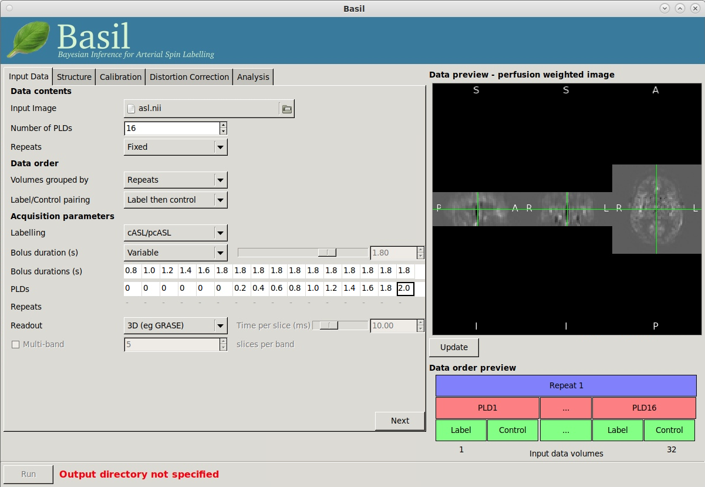
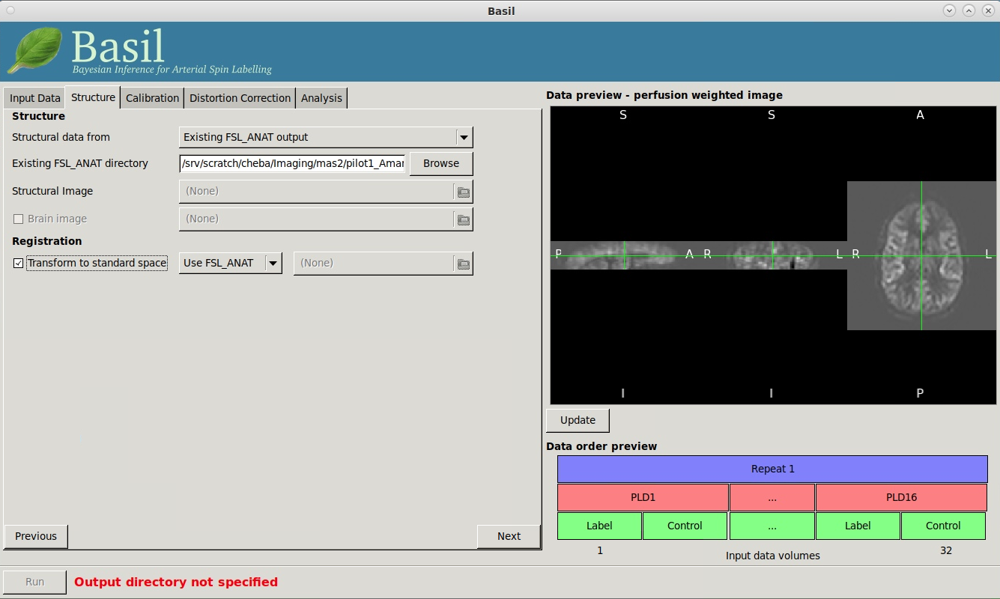
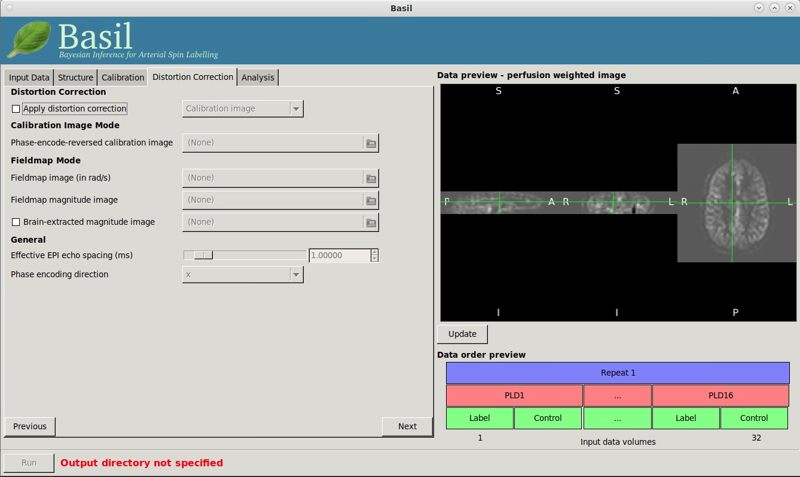
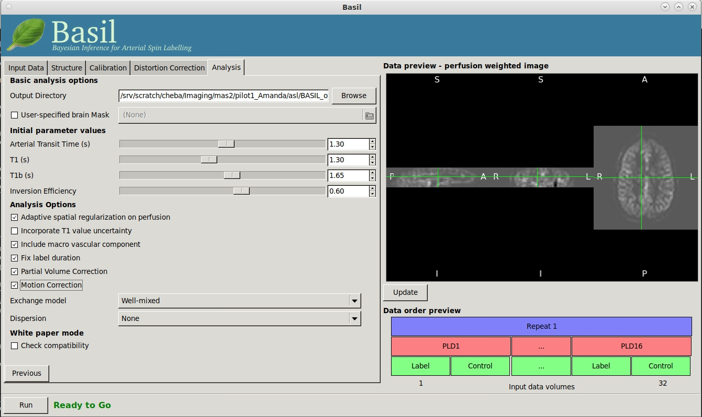

Processing multi PLD ASL data from VCI and MAS2 studies using BASIL GUI
-------------------------------------------------------------------------

Extract lateral ventricles
~~~~~~~~~~~~~~~~~~~~~~~~~~
First, we aim to separate M0 map from tag/control pairs, and extract lateral ventricles from M0 map. In VCI/MAS2 data, the first volume of the 4D ASL dataset is M0 map.

..  code-block::

    # extract the 1st volume as M0, and the rest as tag/control ASL pairs
    fslroi mTI16_800-3800_tgse_pcasl_3.4x3.4x4_14_31_2_24slc_20230721150610_21001 m0 0 1
    fslroi mTI16_800-3800_tgse_pcasl_3.4x3.4x4_14_31_2_24slc_20230721150610_21001 asl 1 -1
    gunzip m0.nii.gz asl.nii.gz

    # extract lateral ventricles
    mkdir ventricle
    module load matlab/R2019a
    curr_dir=$(pwd)
    t1w='T1_MEMPRAGE_64ch_RMS_20230803144848_13.nii'
    matlab -nodesktop -nodisplay -r "addpath(fullfile(getenv('BMP_PATH'),'misc'));bmp_misc_getLatVent('${curr_dir}/m0.nii','${curr_dir}/${t1w}','${curr_dir}/ventricle');exit"

    # erosion to get conservative ventricles
    fslmaths ${curr_dir}/ventricle/rventricular_mask.nii -kernel boxv 2 -ero ${curr_dir}/vent_ero
    # You may see this warning: "Off-centre morphfilter being performed as kernel has even dimensions" - not to worry!

    # !! Always good to check eroded ventricular mask
    # fsleyes ${curr_dir}/m0 ${curr_dir}/vent_ero

Run fsl_anat on T1 image
~~~~~~~~~~~~~~~~~~~~~~~~
Next, we run *fsl_anat* on T1 image. The results will be used as structural reference.

..  code-block::

    fsl_anat -i ${t1w} -o t1

Create folder to store BASIL outputs
~~~~~~~~~~~~~~~~~~~~~~~~~~~~~~~~~~~~

..  code-block::

    mkdir BASIL_output

Input Data - Data contents
~~~~~~~~~~~~~~~~~~~~~~~~~~
* **Input Image**: select *asl.nii*.
* **Number of PLDs**: There are 16 PLDs in VCI/MAS2 ASL datasets.
* **Repeats**: *Fixed*.

Input Data - Data order
~~~~~~~~~~~~~~~~~~~~~~~
* **Volumes grouped by**: *Repeats*. Although it is quite common that multi-PLD ASL data are acquired in repeats and each repeat has several PLDs, it may vary as of how it is ordered in the final image file. VCI/MAS2 ASL data are ordered according to repeats. The data order preview at the bottom right connor of GUI (screenshot below) illustrates how data in VCI/MAS2 are ordered.

  ..  image:: figures/ASL_data_order_preview.png
      :width: 600

* **Label/Control pairing**: *Label then control*. This is determined by changing the options and *update* data preview for perfusion weighted image on the right side of GUI (see screenshots below).

  ..  figure:: figures/ASL_PWI_data_preview_LC.png
      :width: 600

  *PWI data preview when assuming label-then-control order.*

  ..  figure:: figures/ASL_PWI_data_preview_CL.png
      :width: 600

  *PWI data preview when assuming control-then-label order.*

..  note::

    Note that getting a plausible looking PWI is a good sign that the data order (tag-then-control, or control-then-tag) is correct, but it is not a guarantee that the PLD ordering is correct. Always check carefully - one way is to open data in *fsleyes* and look at the timeseries: the raw intensity of both label and control images for one PLD are different to those from another PLD (due to background suppression). The timeseries for the raw data looks like a series of steps, indicating the repeated measurements from each PLD are grouped together (*vs.* grouped by repeats).

    VCI/MAS2 data has only 1 repeat, and 16 tag-control pairs (see time series screenshot below).

    ..  image:: figures/ASL_time_series.png
        :width: 800

Input Data - Acquisition parameters
~~~~~~~~~~~~~~~~~~~~~~~~~~~~~~~~~~~
* **Labelling**: *cASL/pcASL*.

* **Bolus duration (s)**: *Variable*.

* **Bolus durations (s)** and **PLDs**: See table below. This is a specific parameter handling by Siemens for multi-TI regarding PCASL LDs and PLDs. See Page 11 of Siemens WIP ASL document.

  ..  table:: **LDs and PLDs**

    +-------------------------+-----+-----+-----+-----+-----+-----+-----+-----+-----+-----+-----+-----+-----+-----+-----+-----+
    | **Bolus durations (s)** | 0.8 | 1.0 | 1.2 | 1.4 | 1.6 | 1.8 | 1.8 | 1.8 | 1.8 | 1.8 | 1.8 | 1.8 | 1.8 | 1.8 | 1.8 | 1.8 |
    +-------------------------+-----+-----+-----+-----+-----+-----+-----+-----+-----+-----+-----+-----+-----+-----+-----+-----+
    | **PLDs**                |  0  |  0  |  0  |  0  |  0  |  0  | 0.2 | 0.4 | 0.6 | 0.8 | 1.0 | 1.2 | 1.4 | 1.6 | 1.8 | 2.0 |
    +-------------------------+-----+-----+-----+-----+-----+-----+-----+-----+-----+-----+-----+-----+-----+-----+-----+-----+

* **Readout**: *3D (eg GRASE)*. 

The final 'Input Data' tab should look like below:

Now, click *Next* to go to *Structure* tab.

Structure - Structure
~~~~~~~~~~~~~~~~~~~~~
* **Structural data from**: *Existing FSL_ANAT output*.

* **Existing FSL_ANAT directory**: Click *Browse* to select fsl_anat directory (t1.anat) generated in *Run fsl_anat on T1 image* section.

Structure - Registration
~~~~~~~~~~~~~~~~~~~~~~~~
* Tick **Transform to standard space**, and choose **Use FSL_ANAT**.

The final 'Structure' tab should look like below:

Click *Next* to go to *Calibration* tab.

Calibration - Enable Calibration
~~~~~~~~~~~~~~~~~~~~~~~~~~~~~~~~
* Tick **Enable Calibraiton**.

* **Calibration Image**: Choose *m0.nii*.

* **M0 Type**: *Proton density (long TR)*. I couldn't find information from WIP document or protocol PDF. BASIL tutorial said the most common case would be proton density. In addition, M0 is in the same 4D dataset as tag-control pairs, and therefore share the same TR in json/header. I leave this parameter as *Proton density (long TR)* for now. `This reference <https://www.jiscmail.ac.uk/cgi-bin/wa-jisc.exe?A2=ind2002&L=FSL&P=R60377>`_ may give some peace of mind.

* **Sequence TR (s)**: *4.14*. JSON file says the *RepetitionTime* is 8.43617 seconds, and *RepetitionTimeExcitation* is 4.14 seconds. Protocol PDF says TR is 4.14 seconds. I am not sure about this, and leaving it as 4.14 for now as this is the TR in everywhere except for JSON converted from DICOM by myself.

* **Calibration Gain**: *10*. 10 is the common value set for calibration gain (Reference `1 <https://www.jiscmail.ac.uk/cgi-bin/wa-jisc.exe?A2=ind1905&L=FSL&P=R86460>`_, `2 <https://www.jiscmail.ac.uk/cgi-bin/wa-jisc.exe?A2=ind2004&L=FSL&P=R91652>`_, and `3 <https://www.jiscmail.ac.uk/cgi-bin/wa-jisc.exe?A2=ind1904&L=FSL&P=R57828>`_). The WIP document says that the M0 image is always scaled down by a factor of 10.

* **Calibration mode**: *Reference Region*.

Calibration - Reference tissue
~~~~~~~~~~~~~~~~~~~~~~~~~~~~~~
* **Type**: *CSF*.

* Tick **Mask** and selct the ventricular mask generated in the earlier step (e.g., vent_ero.nii.gz).

* **Sequence TE (ms)**: *20.4*. 20.4 msec is the TE found on both JSON and protocol PDF.

* Leave **Reference T1 (s)**, **Reference T2 (ms)**, and **Blood T2 (ms)** as default.

* Untick **Reference Image for sensitivity correction**.

The final 'Calibration' tab should look like below:

..  image:: figures/ASL_calibration.png
    :width: 600

Click *Next* to go to *Distortion Correction* tab.

Distortion Correction
~~~~~~~~~~~~~~~~~~~~~
* Untick **Apply distortion correction**. Also see *further work* section.

We leave out distortion correction for now, but also see *further work* section. The final "Distortion Correction" tab should look like:

Click *Next* to go to *Analysis* tab.

Analysis - Basic analysis options
~~~~~~~~~~~~~~~~~~~~~~~~~~~~~~~~~
* **Output Directory**: Select the output directory created before (e.g., BASIL_output).

* Untick **User-specified brain Mask**.

Analysis - Initial parameter values
~~~~~~~~~~~~~~~~~~~~~~~~~~~~~~~~~~~
* Leave **Arterial Transit Time (s)**, **T1 (s)**, and **T1b (s)** as defaults.

* **Inversion Efficiency**: *0.6*. Default inversion efficiency (alpha) for cASL is 0.85. Nevertheless, WIP document stated that 1) for PCASL without background suppression (i.e., 0 background suppression pulses), alpha is 85%, 2) PCASL with GRAY-WHITE background suppression (i.e., 2 background suppression pulses) has an alpha of 70%, and 3) PCASL with GRAY-WHITE-STRONG background suppression (which is used in our VCI/MAS2 data according to protocol PDF) has an alpha of 60%. Therefore, 0.6 is set here.

Analysis - Analysis Options
~~~~~~~~~~~~~~~~~~~~~~~~~~~
- **Adaptive spatial regularisation on perfusion**: *tick*. This option applies a spatial prior to the perfusion image during estimation, thus making use of neighbourhood information. This is strongly recommended.

- **Incorporate T1 uncertainty**: *untick*. This option permits voxelwise variability in the T1 values, this will primiarly be reflected in the variance images for the estimated parameters, don't expect accurate T1 maps from conventional ASL data.

- **Include macro vascular component**: *tick*. This option corrects for arterial or macrovascular contamination, and it suits where the data have multi-PLD (even where flow suppresion has been applied).

- **Fix label duration**: *tick*. This option takes the value for the label duration from the Input Data tab as fixed, turn off to estimate this from the data (the value on the data tab will be used as prior information in that case). You are most likely to want to deselect the option for pASL data, particularly where QUIPSSII/Q2TIPS has not been used to fix the label duration.

- **Partial Volume Correction**: *tick*. This option correct for the different contributions from GM, WM and CSF to the perfusion image. This will produce separate grey and white matter perfusion maps.

- **Motion Correction**: *tick*. This option uses *mcflirt* to perform motion correction of ASL data (and the calibration image).

- **Exchange/Dispersion model**: Leave as default.

Analysis - White paper mode
~~~~~~~~~~~~~~~~~~~~~~~~~~~
* Untick *check compatibility* to use our customised settings for now.

The final "Analysis" tab should look like:

Now, click "Run" to start processing.

Command line
~~~~~~~~~~~~
The above settings were translated into the following command:

..  code-block::

    oxford_asl -i=/srv/scratch/cheba/Imaging/mas2/ppt1_20230810_ID10011/dnld_from_flywheel/asl/work/asl.nii --iaf=tc --ibf=rpt --casl --bolus=0.8,1,1.2,1.4,1.6,1.8,1.8,1.8,1.8,1.8,1.8,1.8,1.8,1.8,1.8,1.8 --rpts=1,1,1,1,1,1,1,1,1,1,1,1,1,1,1,1 --tis=0.8,1,1.2,1.4,1.6,1.8,2,2.2,2.4,2.6,2.8,3,3.2,3.4,3.6,3.8 --fslanat=/srv/scratch/cheba/Imaging/mas2/ppt1_20230810_ID10011/dnld_from_flywheel/asl/work/t1.anat -c=/srv/scratch/cheba/Imaging/mas2/ppt1_20230810_ID10011/dnld_from_flywheel/asl/work/m0.nii --cmethod=single --tr=4.14 --cgain=10 --tissref=csf --csf=/srv/scratch/cheba/Imaging/mas2/ppt1_20230810_ID10011/dnld_from_flywheel/asl/work/vent_ero.nii.gz --t1csf=4.3 --t2csf=750 --t2bl=150 --te=20.4 -o=/srv/scratch/cheba/Imaging/mas2/ppt1_20230810_ID10011/dnld_from_flywheel/asl/work/BASIL_output_M0-TR-4p14_correctLDPLDgui --bat=1.3 --t1=1.3 --t1b=1.65 --alpha=0.6 --spatial=1 --fixbolus --mc --pvcorr

Further work
~~~~~~~~~~~~
* Need to find evidence to determine M0 type. M0 type is currently set to the default *proton density (long TR)* for now, as no info is found in documents.

* What is the TR for M0? It is in the same 4D dataset as the tag-control pairs

* ASL has a PE direction of "j" (i.e., PA). In pilot scan 1, AP/PA B0's for correcting distortions in DWI were acquired very close to ASL. Therefore, can consider using PA B0 for distortion correction for ASL.
