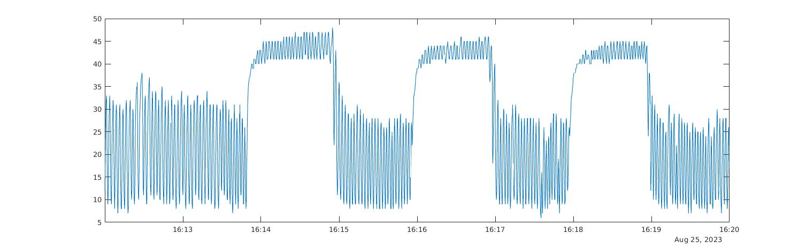

Cerebrovascular reactivity (CVR) in VCI study
=============================================

Existing resources for data processing
--------------------------------------
* `phys2cvr GitHub <https://github.com/smoia/phys2cvr>`_.
* `Quantiphyse CVR analysis tutorial <https://quantiphyse.readthedocs.io/en/latest/cvr/tutorial.html>`_.
* ?? `repidtide for time lag correlation analysis <https://github.com/bbfrederick/rapidtide>`_
* Data analysis in CVR MRI section of Liu et al.'s `CVR technical review <https://pubmed.ncbi.nlm.nih.gov/29574034/>`_

Quantiphyse CVR analysis
-------------------------
Here, I followed `quantiphyse CVR tutorial <https://quantiphyse.readthedocs.io/en/latest/cvr/tutorial.html>`_, and recorded alterations I made below. The content on the tutorial webpage is not repeated.

Installation
++++++++++++
Note that I installed this on local Ubuntu machine.

..  note::

	[ERROR] : gcc: fatal error: cannot execute ‘cc1plus’: execvp: No such file or directory

	[SOLUTION] : sudo apt-get install g++

..  note::

	The "Installing plugins" section on the documentation website does not include CVR widget. To install, ``pip install quantiphyse-cvr``.

..  note::

	[ERROR] : missing libraries, 'libnvinfer.so.7', 'libnvinfer_plugin.so.7'

	[SOLUTION] : 

	..  code-block::

		pip install tentorRT

		ln -s /software/miniconda3/envs/quantiphyse/lib/python3.7/site-packages/tensorrt_libs/libnvinfer.so.8 /software/miniconda3/envs/quantiphyse/lib/python3.7/site-packages/tensorrt_libs/libnvinfer.so.7

		ln -s /software/miniconda3/envs/quantiphyse/lib/python3.7/site-packages/tensorrt_libs/libnvinfer_plugin.so.8 /software/miniconda3/envs/quantiphyse/lib/python3.7/site-packages/tensorrt_libs/libnvinfer_plugin.so.7

		export LD_LIBRARY_PATH=$LD_LIBRARY_PATH:/software/miniconda3/envs/quantiphyse/lib/python3.7/site-packages/tensorrt_libs/

FSL FEAT to preprocess BOLD data
++++++++++++++++++++++++++++++++

* Open FSL GUI -> FEAT FMRI analysis

  * Optional : unclick "Progress watcher" in "Misc".

* First-level analysis -> Preprocessing

* Data tag : 

  * Number of inputs -> Select 4D data (Note : give full path)

    * input the actual number of fMRI images
    * use "ls -1" to list all fMRI images, and "Paste" to the GUI.
    * use absolute path, e.g. "ls -1 /path/to/BOLD/images.nii*"

  * Output directory: Create a folder, and give the path here.

  * Delete volumes -> 0. We don't delete any volumes, to make calculation of time easier.
              
  * High pass threshold -> 90 (**This value follows quantiphyse tutorial. May need to change.**)

* Pre-stats tag :      

  * Alternative reference image: untick.

  * Motion correction: MCFLIRT
    
  * B0 unwarping: untick (**implement distortion correction in the future.**)
                  
  * Slice timing correction: Interleaved (**get from PDF protocol. Need to confirm as JSON said sequential.**)

  * BET brain extraction: tick.

  * Spatial smoothing FWHM (mm): 6.

  * intensity normalization = untick
    
  * Temporal filtering: tick "Highpass", untick "Perfusion subtraction".
                                         
  * MELODIC ICA data exploration: untick.

* Registration tag : 

  * Main structural image: tick
    
    * Select main struct imgs = BRAIN EXTRACTED structural image. Brain extraction can be done by, e.g., optiBET.sh. Remember that the whole head image should have the same filename as brain extracted but without '_brain'. For example, T1w.nii.gz and T1w_brain.nii.gz.

    * Linear - Normal search - BBR
    
  * Standard space: tick

    * Use default MNI 2mm brain.

    * Linear - Normal search - 12 DOF
    
    * Nonlinear: tick

    * Warp resolution (mm): 10. Increasing this will get a smoother warp field.

* Click 'Save' to save config files to a folder.

* ${FSLDIR}/bin/feat /path/to/saved/*.fsf

Extract EtCO2
-------------
* When input EtCO2 trace, a single column of EtCO2 reading without heading is needed. This can be extracted by ``awk -F',' '{print $3}' 0004_2023_08_24_15_57_02_cw.csv | tail -n +2 > etCO2_only.txt``. If you want to crop to the useful sectoin, ``awk -F',' '{print $3}' 0004_2023_08_24_15_57_02_cw.csv | tail -n +2800 | head -n 2700 > etCO2_only.txt`` (from line 2800 to end, then the first 2700 lines).

Settings in 'Acquisition Options' tab
-------------------------------------
* TR is 1.5 second.

* Baseline period (s): 77. This is the duration of baseline used in the pilot scan. Since the total length of scan is 7 min 17 sec, the first switch to CO2 happened at 1 min 17 sec.

Visualise etCO2 trace
---------------------

..  code-block::

	% This is a MATLAB script

	setenv ('TZ', 'Australia/Sydney');  % otherwise a warning of system time zone setting will araise.
	cw = radtable ('0004_2023_08_24_15_57_02_cw.csv', "Delimiter", ",", "ReadVariableNames", true);
	cw.Time = datetime (string (cw.Time, 'hh:mm:ss.SSS'), 'Format', 'HH:mm:ss.SSS'); % convert duration to datetime

	% zoom-in to useful duration (need to change accordingly)
	experiment_start = '16:12:00.000';
	experiment_end   = '16:20:00.000';

	cw_new = cw (cw.Time > datetime (experiment_start, 'InputFormat', 'HH:mm:ss.SSS') & ...
				 cw.Time < datetime (experiment_end, 'InputFormat', 'HH:mm:ss.SSS'), :);

	plot (cw_new.Time, cw_new.CO2_mmHg_)

Figure below shows what I get from pilot scan:

According to `the CVR technical review <https://pubmed.ncbi.nlm.nih.gov/29574034/>`_:

* During **room-air** breathing, the bottom of signal is approximately **zero** because there is virtually no CO2 in the inhaled room-air.
* During **room-air** breathing, the upper peak of the signal is approximately **40 mmHg**, which is typical of etCO2 for a healthy volunteer.
* During **hypercapnia** breathing, the bottem of signal is **38 mmHg**, which is consistent with CO2 content in the inhaled air of 5% of atmospheric pressure (760 mmHg).
* During **hypercapnia** breathing, the upper peak of the signal is typically 8-12 mmHg above the value during room-air breathing, i.e. **48-52 mmHg**.

Figure below shows a typical CO2 trace recording (copied from `the CVR technical review <https://pubmed.ncbi.nlm.nih.gov/29574034/>`_)

..  figure:: figures/CVR_technicalReview_etCO2trace.png
	:width: 400
	:align: center

