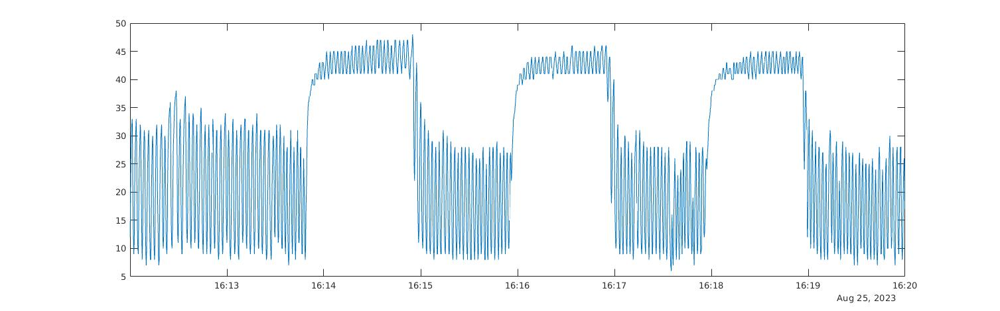
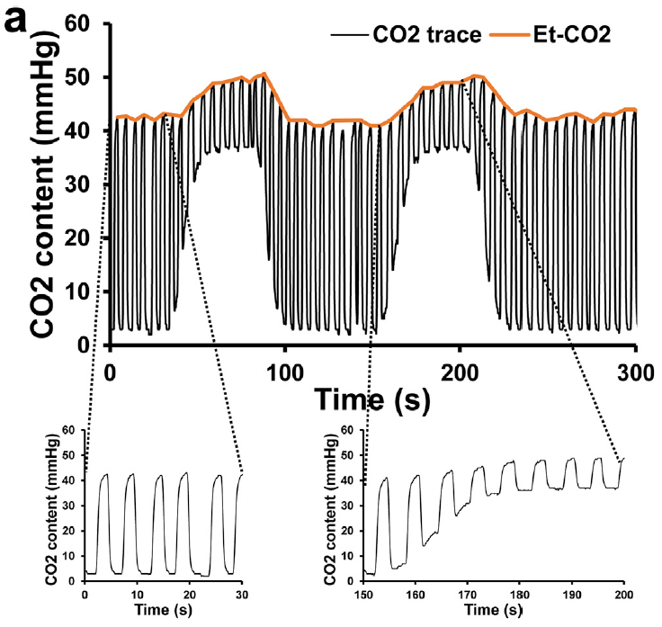

Visualise EtCO2 trace
---------------------

..  code-block::

	% This is a MATLAB script

	setenv ('TZ', 'Australia/Sydney');  % otherwise a warning of system time zone setting will araise.
	cw = readtable ('0004_2023_08_24_15_57_02_cw.csv', "Delimiter", ",", "ReadVariableNames", true);
	cw.Time = datetime (string (cw.Time, 'hh:mm:ss.SSS'), 'Format', 'HH:mm:ss.SSS'); % convert duration to datetime

	% zoom-in to useful duration (need to change accordingly)
	experiment_start = '16:12:00.000';
	experiment_end   = '16:20:00.000';

	cw_new = cw (cw.Time > datetime (experiment_start, 'InputFormat', 'HH:mm:ss.SSS') & ...
				 cw.Time < datetime (experiment_end, 'InputFormat', 'HH:mm:ss.SSS'), :);

	plot (cw_new.Time, cw_new.CO2_mmHg_)

Figure below shows what I get from pilot scan:

According to `the CVR technical review <https://pubmed.ncbi.nlm.nih.gov/29574034/>`_:

* During **room-air** breathing, the bottom of signal is approximately **zero** because there is virtually no CO2 in the inhaled room-air.
* During **room-air** breathing, the upper peak of the signal is approximately **40 mmHg**, which is typical of etCO2 for a healthy volunteer.
* During **hypercapnia** breathing, the bottem of signal is **38 mmHg**, which is consistent with CO2 content in the inhaled air of 5% of atmospheric pressure (760 mmHg).
* During **hypercapnia** breathing, the upper peak of the signal is typically 8-12 mmHg above the value during room-air breathing, i.e. **48-52 mmHg**.

Figure below shows a typical CO2 trace recording (copied from `the CVR technical review <https://pubmed.ncbi.nlm.nih.gov/29574034/>`_)

Visualise EtCO2 sampling frequency
----------------------------------

..  code-block::

	% This is a MATLAB script

	setenv ('TZ', 'Australia/Sydney');  % otherwise a warning of system time zone setting will araise.
	cw = readtable ('0004_2023_08_24_15_57_02_cw.csv', "Delimiter", ",", "ReadVariableNames", true);
	cw.Time = datetime (string (cw.Time, 'hh:mm:ss.SSS'), 'Format', 'HH:mm:ss.SSS');

	g = zeros ((length(cw.Time)-1),2);

	for i = 2 : length (cw.Time)
		g(i-1,1) = i - 1;
		g(i-1,2) = milliseconds (cw.Time(i) - cw.Time(i-1));
	end

	figure
	plot(g(:,1),g(:,2))
	hold on
	yline(mean(g(:,2)), '-', sprintf ('Avg interval %.3f milliseconds.', mean(g(:,2))));
	hold off
