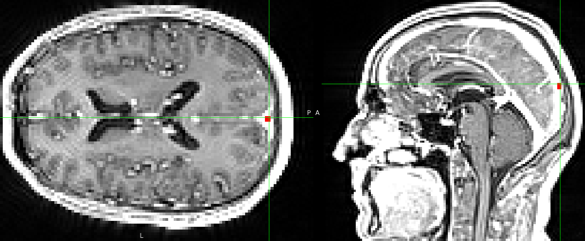
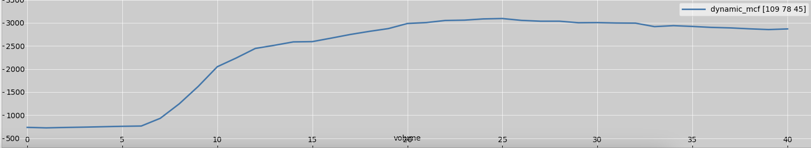

Processing DCE-MRI using SEPAL
==============================

Followed tutorial in `this notebook <https://github.com/mjt320/SEPAL/blob/master/demo/demo_fit_dce.ipynb>`_.


Creating mask of superior sagittal sinus for VIF
---------------------------------------------------------
#. ``fslmaths dynamic_Tmean -thr 0 -uthr 0 SSS_mask```

#. Use *fsleyes* to open realigned DCE dataset, and the empty SSS_mask created above.

#. Change *volume* of DCE dataset to display the later volumes where enhancement is obvious (e.g., ~ 20th volume).

#. Locate posterior part of superior sagittal sinus (see figure below).



#. In *fsleyes*, use ``Tools`` >> ``Edit mode`` to draw a rectangular mask of posterior part of superior sagittal sinus. ``View`` >> ``Time series`` can be turned on to assist localising. A proper time series curve for enhancement in superior sagittal sinus should look like below.



#. Save *SSS_mask*.

Apply SSS mask to T1, B1, and dynamic dataset to extract values
----------------------------------------------------------------------------
#. Apply SSS mask to dynamic dataset to extract "time series" within the mask: ``fslmeants -i dynamic_mcf -m SSS_mask -o dyn_meants_in_SSS.txt``.

#. Apply SSS mask to T1 map (uncorrected for B1) and calculate mean within mask: ``fslstats T1uncorr_reg2dyn -k SSS_mask -M > T1_in_SSS.txt``.

#. Apply SSS mask to B1 map and calculate mean within mask: ``fslstats B1map_reg2dyn -k SSS_mask -M > B1_in_SSS.txt``.

Create mask of subcortical GM
--------------------------------------
#. Run FSL FIRST on Tmean of dynamic dataset: ``run_first_all -i dynamic_Tmean -o fslfirst``.

#. Create subcortical GM mask: ``fslmaths fslfirst_all_fast_firstseg -bin subcor_GM_mask``.

#. Apply subcortical GM mask to dynamic dataset to extract "time series" within the mask: ``fslmeants -i dynamic_mcf -m subcor_GM_mask -o dyn_meants_in_subcorGM.txt``.

#. Apply subcortical GM mask to T1 map (uncorrected for B1) and calculate mean within mask: ``fslstats T1uncorr_reg2dyn -k subcor_GM_mask -M > T1_in_subcorGM.txt``.

#. Apply subcortical GM mask to B1 map and calculate mean within mask: ``fslstats B1map_reg2dyn -k subcor_GM_mask -M > B1_in_subcorGM.txt``.

ROI and voxel-wise analyses
---------------------------

Refer to the Jupyter Notebook