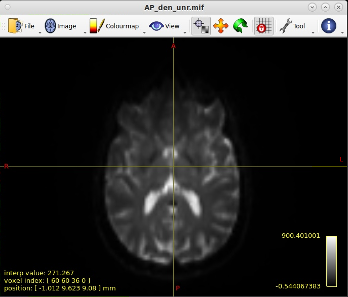

Diffusion-weighted imaging (DWI)
--------------------------------

Multi-shell diffusion-weighted imaging data with MRtrix3 and FSL
================================================================
This section records steps for processing multi-shell dMRI data using MRtrix3 and FSL. The VCI and MAS2 study data will suit the methods described here.

.. _VCI and MAS2 DWI data description:

Description of dMRI data acquired for VCI and MAS2
++++++++++++++++++++++++++++++++++++++++++++++++++
VCI and MAS2 dMRI data were acquired in 4 blocks, together with B0 images acquired in reverse phase encoding directions for distortion correction:

* 4 B0 images in posterior-anterior (PA) PE direction
  
  * Series description = PA_FMAP_for_DIFFUSION

* 4 B0 images in anterior-posterior (AP) PE direction

  * Series description = AP_FMAP_for_DIFFUSION

* AP block 1 has 31 volumes including:
  
  * 3 B0's (Volume #1, #2, #20)
  * 28 B1 directions in AP PE direction including:

    * 5  * B1=1000
    * 1  * B1=1950
    * 7  * B1=2000
    * 1  * B1=2950
    * 14 * B1=3000

  * Series description = AP_BLOCK_1_DIFFUSION_30DIR

* AP block 2 has 31 volumes including:

  * 3 B0's (Volume #1, #2, #20)
  * 28 B1 directions in AP PE direction including:

    * 5  * B1=1000
    * 8  * B1=2000
    * 1  * B1=2950
    * 14 * B1=3000

  * Series description = AP_BLOCK_2_DIFFUSION_30DIR

* PA block 1 has 31 volumes including:

  * 3 B0's (Volume #1, #2, #20)
  * 28 B1 directions in PA PE direction including:

    * 5 *  B1=1000
    * 8 *  B1=2000
    * 15 * B1=3000

  * Series description = PA_BLOCK_1_DIFFUSION_30DIR

* PA block 2 has 31 volumes including:

  * 3 B0's (Volume #1, #2, #20)
  * 28 B1 directions in PA PE direction including:

    * 5 *  B1=1000
    * 8 *  B1=2000
    * 1 *  B1=2950
    * 14 * B1=3000

  * Series description = PA_BLOCK_2_DIFFUSION_30DIR

The acquisition was separated into 4 blocks so that if volumes in a certain block are of poor quality, only the gradient table in that particular block needs to be repeated, saving scanning time. This is particularly favourable for participants with cognitive decline or dementia. The sequence also sample higher b-value shells with a good number of directions. It also integrated many good acpects of HCP diffusion protocols. The sequnce takes 10 minutes to run, with each block taking 2.5 minutes. Voxel size = 2.23 * 2.23 * 2.0 mm^3, in-plane = 122 * 122, 74 slices.

Brief overview of MRtrix method
+++++++++++++++++++++++++++++++
* *Issue with the traditional tensor model of diffusion data*: In brain regions containing crossing or kissing (i.e., tangentially touching) fibers, diffusion tensor model does not perform well. This is because tensor model approaches fiber orientatin with an ellipsoid shape. In crossing-fiber regions, the orientation estimation of the tensor model will approach a sphere and thus cannot capture the orientation of two separate fibers. This is a severe problem as up to 90% of all brain image voxels contain crossing fibers.
* *The way MRtrix approach crossing-fiber issue*: Constrained Spherical Deconvolution (CSD) is proposed by MRtrix, which outperforms tensor model and other alternatives for crossing fibers.
* *Further development of MRtrix after CSD*: Following the success of CSD, MRtrix developers developed more algorithms to improve biological plausibility of fiber tracking:

  * *Anatomically Constrained Tractography (ACT)*: Rejects streamlines that end in biologically implausible tissue (e.g., CSF).
  * *Spherical-deconvolution informed filtering of tractograms (SIFT)*: Corrects for the fact that longer streamlines tend to be overestimated in tractography.
  * *multi-shell multi-tissue CSD (MSMT)*: Improves tractography in voxels containing partial volumes by exploiting the differences in b-value sensitivity of different tissue types.

Detailed processing steps
+++++++++++++++++++++++++

Convert DICOM data
~~~~~~~~~~~~~~~~~~

..  note::
	
	Note that it seems DWI data transferred from scanner to Flywheel will lose some info, and are not compatible with MRtrix. Some observed issues include: 1) error of "slice position information missing from DICOM header!" when using mrconvert/mrinfo/mrcat to convert/view DICOM data downloaded from Flywheel, and 2) mif converted from data downloaded from Flywheel has more than 4 dimentions, and gives error of "contains more than 4 dimensions" when concatenate with other mif. By using mrinfo to view the header, dimension is 122 x 122 x 1 x 74 x 9, while 122 x 122 x 74 x 31 is expected. These errors led me to work around it using the following methods and data copied from scanner to a portable hard drive.

Use *3D Slicer* to extract series with the following series description to a specific folder, e.g., *3DslicerExtractedDWI*.

* PA_FMAP_for DIFFUSION
* AP_FMAP_for DIFFUSION
* AP_BLOCK_1_DIFFUSION_30DIR
* AP_BLOCK_2_DIFFUSION_30DIR
* PA_BLOCK_1_DIFFUSION_30DIR
* PA_BLOCK_2_DIFFUSION_30DIR

Use the following commands to convert DICOM to MIF:

..  code-block::

	mrconvert /path/to/3DslicerExtractedDWI PA_B0.mif
	mrconvert /path/to/3DslicerExtractedDWI AP_B0.mif
	mrconvert /path/to/3DslicerExtractedDWI AP_1.mif
	mrconvert /path/to/3DslicerExtractedDWI AP_2.mif
	mrconvert /path/to/3DslicerExtractedDWI PA_1.mif
	mrconvert /path/to/3DslicerExtractedDWI PA_2.mif

Each *mrconvert* command will generate the following output in the shell:

..  code-block::

	mrconvert: [.   ] scanning DICOM folder "/srv/scrat...2pilot/3DslicerExtractedDWI"...
	mrconvert: [WARNING] mismatched series number and UID - this may cause problems with series grouping
	mrconvert: [done] scanning DICOM folder "/srv/scrat...2pilot/3DslicerExtractedDWI"
	Select series ('q' to abort):
	   0 -  240 MR images 15:50:05 PA_FMAP_for DIFFUSION (*epse2d1_86) [25001] ORIGINAL PRIMARY M ND NORM MFSPLIT
	   1 -  240 MR images 15:50:42 AP_FMAP_for DIFFUSION (*epse2d1_86) [26001] ORIGINAL PRIMARY M ND NORM MFSPLIT
	   2 - 2294 MR images 15:51:51 AP_BLOCK_1_DIFFUSION_30DIR (*ep_b0) [27001] ORIGINAL PRIMARY DIFFUSION NONE ND NORM MFSPLIT
	   3 - 2294 MR images 15:54:44 AP_BLOCK_2_DIFFUSION_30DIR (*ep_b0) [35001] ORIGINAL PRIMARY DIFFUSION NONE ND NORM MFSPLIT
	   4 - 2294 MR images 15:57:37 PA_BLOCK_1_DIFFUSION_30DIR (*ep_b0) [43001] ORIGINAL PRIMARY DIFFUSION NONE ND NORM MFSPLIT
	   5 - 2294 MR images 16:00:29 PA_BLOCK_2_DIFFUSION_30DIR (*ep_b0) [51001] ORIGINAL PRIMARY DIFFUSION NONE ND NORM MFSPLIT
	?

Select corresponding series number for the mrconvert call. For example, when converting PA_B0.mif, select 0. When converting AP_B0, select 1, and so on.

Then, concatenate all DWI data acquired in the same PE direction:

..  code-block::

	dwicat AP_1.mif AP_2.mif AP.mif
	dwicat PA_1.mif PA_2.mif PA.mif

`dwicat <https://mrtrix.readthedocs.io/en/dev/reference/commands/dwicat.html>`_ is used to automatically adjust for differences in intensity scaling.

Denoising
~~~~~~~~~
To estimate the spatially varying noise map.

..  code-block::

	dwidenoise AP.mif AP_den.mif -noise AP_noise.mif   		# denoise AP.mif
	dwidenoise PA.mif PA_den.mif -noise PA_noise.mif   		# denoise PA.mif

	mrcalc AP.mif AP_den.mif -subtract AP_residual.mif 		# calculate difference btw raw and denoised iamges
	mrview AP_noise.mif AP_residual.mif

	mrcalc PA.mif PA_den.mif -subtract PA_residual.mif
	mrview PA_noise.mif PA_residual.mif

Using MRView, we can visualise the noise and difference maps. Use *page up/done* key to change between the displayed images.

..  image:: figures/AP_noise.png
    :width: 400

..  image:: figures/PA_noise.png
    :width: 400

Unringing
~~~~~~~~~
To remove Gibb's ringing artefacts.

..  code-block::

		mrdegibbs AP_den.mif AP_den_unr.mif -axes 0,1
		mrdegibbs PA_den.mif PA_den_unr.mif -axes 0,1

		# -axes is used to inform the plane the data were acquired.
		# -axes 0,1 refers to axial slices.
		# -axes 0,2 refers to coronal slices.
		# -axes 1,2 refers to sagittal slices.

We can then calculate the difference between the denoised image and the unringed image, and visualise the images.

..  code-block::

	mrcalc AP_den.mif AP_den_unr.mif -subtract AP_residual_unringed.mif
	mrcalc PA_den.mif PA_den_unr.mif -subtract PA_residual_unringed.mif

	mrview AP_den_unr.mif AP_residual_unringed.mif
	mrview PA_den_unr.mif PA_residual_unringed.mif

..  image:: figures/AP_residual_unringed.png
	:width: 400

..  image:: figures/PA_residual_unringed.png
	:width: 400

Motion and distortion correction
~~~~~~~~~~~~~~~~~~~~~~~~~~~~~~~~
For EPI distortion correction, a pair of B0 images, one in AP and one in PA PE directions, will be used. Several B0 images were acquired in both PE directions for VCI and MAS2 data, both within the DWI blocks and as separate sequences (refer to `VCI and MAS2 DWI data description`_). The purpose of this is to get a cleaner B0 for either direction by taking the mean. Here we carry out three experiments for distortion correction in VCI and MAS2 data: 1) using the separate B0 acquisitions, 2) using the B0's acquired in DWI blocks, and 3) using both the separate B0's and the B0's in DWI blocks.

  ..  note::

    Note that slice-to-volume motion correction is only available for CUDA version of eddy. Suggest running on GRID workstation at CHeBA where eddy_cuda is already configured.

  ..  note::

	NOTE THAT ACQPARAMS.TXT IS AUTOMATICALLY GENERATED IF YOU RUN DWIFSLPREPRROC. YOU DO NOT NEED TO PREPARE THIS BY YOURSELF. THIS PART IF FOR YOUR REFERENCE IF YOU RUN THE ORIGINAL FSL TOPUP COMMAND.

	To prepare *acqparams.txt* for topup correction, we need to know two things: 1) the order of PE directions in the opposing PE B0 pair, and 2) *BandwidthPerPixelPhaseEncode* field in json file or DICOM header. 
	
	* PE directions.

	  * For a AP PE, the *PhaseEncodingDirection* field in json file or DICOM header should be "j-", and the first 3 digits in acqparam.txt should be "0 -1 0".
	  * For a PA PE, the *PhaseEncodingDirection* field in json file or DICOM header should be "j", and the first 3 digits in acqparam.txt should be "0 1 0".
	  * The lines in acqparam.txt should reflect the order of PE directions in the opposing PE B0 pair.

	* BandwidthPerPixelPhaseEncode

	  * For VCI and MAS2 data, *BandwidthPerPixelPhaseEncode* field in json file has a value of 21.858. The fourth number in acqaram.txt should be 1 / 21.858 = 0.046.

	Therefore, acqparam.txt file for VCI and MAS2 DWI data should read as:

	| 0 -1 0 0.046
	| 0 1 0 0.046

	for *AP-then-PA_B0_pair.mif*, and

	| 0 1 0 0.046
	| 0 -1 0 0.046

	for *PA-then-AP_B0_pair.mif*.

	Reference: https://bookdown.org/u0243256/tbicc/preprocessing-diffusion-images.html#set-acqparams.txt

Experiment 1: using the separately acquired B0's for EPI distortion correction
^^^^^^^^^^^^^^^^^^^^^^^^^^^^^^^^^^^^^^^^^^^^^^^^^^^^^^^^^^^^^^^^^^^^^^^^^^^^^^
We first calculate the mean B0 in each PE direction:

..  code-block::

	mrmath AP_B0.mif mean AP_B0_mean.mif -axis 3 	# '-axis 3': The average will be calculated along the third axis.
	mrmath PA_B0.mif mean PA_B0_mean.mif -axis 3

Next, we concatenate the two mean B0 images into a single file. Note that **order matters** here - MRtrix requires the first image to be the B0 in the PE direction of DWI data, and the last B0 is in reversed PE direction. Since DWI data in VCI and MAS2 have 2 DWI blocks acquired in AP, and another 2 DWI blocks acquired in PA, we concatenate B0's in both ways, generating two B0 pairs for both senarios.

..  code-block::

	mrcat AP_B0_mean.mif PA_B0_mean.mif -axis 3 AP-then-PA_B0_pair.mif
	mrcat PA_B0_mean.mif AP_B0_mean.mif -axis 3 PA-then-AP_B0_pair.mif

To better visualise and understand the distortion effects of AP and PA PE directions, overlay the two mean B0 images:

..  code-block::

	mrview AP_B0_mean.mif -overlay.load PA_B0_mean.mif

	# In the menu bar, click 'View' -> 'Ortho view'.
	# In the menu bar, click 'Tool' -> 'Overlay'. You can change the colour map for overlay, 
	# and adjust opacity to see differences between AP and PA PE effects, and how the following
	# correction will correct the distortion.

Now, we are ready to conduct motion and distortion correction. In MRtrix, both these corrections are carried out by using *dwifslpreproc* command, which will call FSL's *eddy*, *topup*, and *applytopup* tools. Refer to `MRtrix dwifslpreproc webpage 1 <https://mrtrix.readthedocs.io/en/3.0.4/dwi_preprocessing/dwifslpreproc.html>`_ and `2 <https://mrtrix.readthedocs.io/en/dev/reference/commands/dwifslpreproc.html>`_ for more details.

* *AP_den_unr.mif* and *PA_den_unr.mif* as input.
* *-pe_dir* to specify PE direction.
* *-rpe_pair* option to specify that a B0 pair will be provided for EPI inhomogeneity field estimation (i.e., distortion correction). The opposing PE B0 pair will be passed to command by using *-se_epi* option.
* *-se_epi* option to pass the opposing PE B0 pair.
* *-topup_options* to pass topup options. Refer to `FSL topup webpage <https://fsl.fmrib.ox.ac.uk/fsl/fslwiki/topup/TopupUsersGuide>`_ for the list of options.

  * We use default settings for topup here, without customising any options.

* *-eddy_options* to pass eddy options.

  * *--repol*: Remove any slices deemed as outliers and replace them with predictions made by the Gaussian Process. Outlier is defined by *--ol_nstd*, *--ol_nvox*, *--ol_type*, *--ol_pos*, and *--ol_sqr*. If defaults are used for those options, outliers are defined as a slice whose average intensity is at least 4 SD lower than the expected intensity, where the expectation is given by the Gaussian Process prediction. FSL group's experience and tests indicate that it is always a good idea to use *--repol* (`Reference <https://fsl.fmrib.ox.ac.uk/fsl/fslwiki/eddy/UsersGuide#A--repol>`_).

  * *--niter=8 --fwhm=10,6,4,2,0,0,0,0*: Specify 8 iterations with decreasing amounts of smooth to have better chances of convergence. This is `recommended for data with lots of movement <https://fsl.fmrib.ox.ac.uk/fsl/fslwiki/eddy/Faq#What_would_a_good_eddy_command_look_like_for_data_with_lots_of_movement.3F>`_. Another, more general, `recommendation <https://fsl.fmrib.ox.ac.uk/fsl/fslwiki/eddy/UsersGuide/#A--niter>`_ is to have 5 iterations with *--fwhm=10,0,0,0,0*. It means that the first iteration is run with a FWHM of 10mm, which helps that algorithm to take a big step towards the true solution. The remaining iterations are run with a FWHM of 0mm, which offers high accuracy. This was found to work well in most cases. But on he safe side, we chose the previous, more time-consuming but more accurate, option.

  * *--slspec=my_slspec.txt*: slspec file should look like `this <https://fsl.fmrib.ox.ac.uk/fsl/fslwiki/eddy/UsersGuide#A--slspec>`_, and there is `a script <https://fsl.fmrib.ox.ac.uk/fsl/fslwiki/eddy/Faq#How_should_my_--slspec_file_look.3F>`_ to automatically generate this file. The same script is copied below. SPM also offers scripts and some good explanations on slice timing info (`link <https://en.wikibooks.org/w/index.php?title=SPM/Slice_Timing#Slice_Order>`_). Other readings include `this <https://practicalfmri.blogspot.com/2012/07/siemens-slice-ordering.html>`_. **Note** that *dwifslpreproc* requires *my_slspec.txt* to be passed to command through *--eddy_slspec*, instead of *--eddy_opions "--slspec=..."*

  ..  code-block::

	fp = fopen('AP_BLOCK_1_DIFFUSION_30DIR_20230721150610_27001.json','r');
	fcont = fread(fp);
	fclose(fp);
	cfcont = char(fcont');
	i1 = strfind(cfcont,'SliceTiming');
	i2 = strfind(cfcont(i1:end),'[');
	i3 = strfind(cfcont((i1+i2):end),']');
	cslicetimes = cfcont((i1+i2+1):(i1+i2+i3-2));
	slicetimes = textscan(cslicetimes,'%f','Delimiter',',');
	[sortedslicetimes,sindx] = sort(slicetimes{1});
	mb = length(sortedslicetimes)/(sum(diff(sortedslicetimes)~=0)+1);
	slspec = reshape(sindx,[mb length(sindx)/mb])'-1;
	dlmwrite('my_slspec.txt',slspec,'delimiter',' ','precision','%3d');

  ..  warning::

	Although the protocol and the *MultibandAccelerationFactor* field of json file indicate that a multi-band factor of 2 was applied, *SliceTiming* recorded in DICOM/json seems to indicate it was an interleaved acquisition without simultaneous multi-slices.

	**Current solusion**: We presume the *SliceTiming* field gives accurate data, i.e., data were acquired in an interleaved manner without simultaneous multi-slices. We still supply the *my_slspec.txt* file generated by the above code, although it will be a single column indicating slice order (i.e., single band). We also set *--ol_type* option to *both*, although there's only a single multi-band group. In the future, if multi-band is confirmed, simply replace the my_slspec.txt file to reflect this, and other parts do not need to be changed. However, note that *--mporder* value needs to be changed if multi-band is confirmed.

  * *--ol_type=both*: This option defines how outliers are assessed. *both* means that the program will consider an multi-band group as the unit, but additionally looks for slice-wise outliers. This is to find single slices within a group that has been affected by pulsatile movement not affecting the other slices.

  * *--mporder=19*: This option is related to slice-to-volume motion correction. Since this correction is time-consuming, it is `recommended <https://fsl.fmrib.ox.ac.uk/fsl/fslwiki/eddy/UsersGuide#A--mporder>`_ to set the value in the range of N/4 to N/2, where N is the number of excitations per volume. The number of excitations is equivalent to number of slices for single band data, and should divide by multi-band factor for multi-band data. For example an MB/SMS factor of 3 means that you acquired 3 slices for each excitation. If you for example have 63 slices and an MB/SMS factor of 3 it means that you have 21 excitations (`Reference <https://www.jiscmail.ac.uk/cgi-bin/wa-jisc.exe?A2=ind1712&L=FSL&P=R34891>`_). Since we have 74 slices and assume it is single band (no simultaneous multi-slices), this value is now set to 19.

  * *--s2v_niter=8*: This option defines number of iterations for estimating slice-to-volume movement parameters. 5-10 iterations gives good results, with small advantage of 10 over 5. Slice-to-volume is time-consuming.

  * *--s2v_lambda=5*: This option determines the strength of temporal regularisation of the estimated movement parameters. This is especially important for single-band data with "empty" slices at the top/bottom of the FOV. Values in the range 1--10 give good results.

  * *--s2v_interp=trilinear*: This option determines the interpolation model in the slice-direction for the estimation of the slice-to-volume movement parameters. *spline* is theoretically a better interpolation method. However, little advantage is observed during tests conducted by FSL group. Therefore, *trilinear* is recommanded. For the final re-sampling, spline is always used regardless of how --s2v_interp is set.

  * *--data_is_shelled*: By default, *eddy* will check input data is single- or multi-shell diffusion data, i.e., not diffusion spectrum imaging data. The checking is performed through a set of heuristics such as i) how many shells are there? ii) what are the absolute numbers of directions for each shell? iii) what are the relative numbers of directions for each shell? etc. It will for example be suspicious of too many shells, too few directions for one of the shells etc. It has emerged that some popular schemes get caught in this test. Some groups will for example acquire a "mini shell" with low b-value and few directions and that has failed to pass the "check", even though it turns out eddy works perfectly well on the data. For VCI and MAS2 data, there are a small number of volumes acquired at B1=1950 or B1=2950. Therefore, to prevent eddy from failing, *--data_is_shelled* flag is set.

  * *--flm=quadratic*: This option specifies how complicated we believe the eddy current-induced fields may be. Possible inputs include *linear*, *quadratic*, and *cubic*. *linear* and *quadratic* were found to be successful in most cases. HCP data requires *quadratic*. Some more explanations are `here <https://fsl.fmrib.ox.ac.uk/fsl/fslwiki/eddy/UsersGuide#A--flm>`_.

  * *--slm=linear*: This second level model (slm) specifies the mathematical form for how the diffusion gradients cause eddy currents. For high quality data with 60 directions, or more, sampled on the whole sphere FSL group did not find any advantage of performing second level modelling. Hence recommendation for such data is to use none, and that is also the default. If the data has quite few directions and/or it has not been sampled on the whole sphere it can be advantageous to specify *--slm=linear*. Since VCI and MAS2 data did not semple low B1 shells very well (see figure below. The code to generate the figure follows.), we use *--slm=linear* option.

  ..  image:: figures/dwi_gradients.png
      :width: 600

  ..  code-block::

	bvec_AP1 = load('AP_BLOCK_1_DIFFUSION_30DIR_20230721150610_27001.bvec');
	bval_AP1 = load('AP_BLOCK_1_DIFFUSION_30DIR_20230721150610_27001.bval');
	bvec_AP2 = load('AP_BLOCK_2_DIFFUSION_30DIR_20230721150610_35001.bvec');
	bval_AP2 = load('AP_BLOCK_2_DIFFUSION_30DIR_20230721150610_35001.bval');
	bvec_PA1 = load('PA_BLOCK_1_DIFFUSION_30DIR_20230721150610_43001.bvec');
	bval_PA1 = load('PA_BLOCK_1_DIFFUSION_30DIR_20230721150610_43001.bval');
	bvec_PA2 = load('PA_BLOCK_2_DIFFUSION_30DIR_20230721150610_51001.bvec');
	bval_PA2 = load('PA_BLOCK_2_DIFFUSION_30DIR_20230721150610_51001.bval');

	bvecs = [bvec_AP1 bvec_AP2 bvec_PA1 bvec_PA2];
	bvals = [bval_AP1 bval_AP2 bval_PA1 bval_PA2];
	bvecs_bvals = [bvecs;bvals];

	bvecs_B1000 = bvecs_bvals(1:3, bvecs_bvals(4,:)==1000);
	bvecs_B2000 = bvecs_bvals(1:3, bvecs_bvals(4,:)==2000 | bvecs_bvals(4,:)==1950);
	bvecs_B3000 = bvecs_bvals(1:3, bvecs_bvals(4,:)==3000 | bvecs_bvals(4,:)==2950);

	t = tiledlayout (2,2);
	
	nexttile
	plot3(bvecs_B1000(1,:),bvecs_B1000(2,:),bvecs_B1000(3,:),'*r');
	title('B1000');
	axis([-1 1 -1 1 -1 1]);
	axis vis3d;
	rotate3d;

	nexttile
	plot3(bvecs_B2000(1,:),bvecs_B2000(2,:),bvecs_B2000(3,:),'*r');
	title('B2000');
	axis([-1 1 -1 1 -1 1]);
	axis vis3d;
	rotate3d;

	nexttile
	plot3(bvecs_B3000(1,:),bvecs_B3000(2,:),bvecs_B3000(3,:),'*r');
	title('B3000');
	axis([-1 1 -1 1 -1 1]);
	axis vis3d;
	rotate3d;

  * *--estimate_move_by_susceptibility*: Specifies that eddy shall attempt to estimate how the susceptibility-induced field changes when the subject moves in the scanner. FSL recommends it is used when scanning populations that move "more than average", such as babies, children or other subjects that have difficulty remaining still. It can also be needed for studies with long total scan times, such that even in corporative subjects the total range of movement can become big.

  * *--cnr_maps*: This will generate *my_eddy_output.eddy_cnr_maps*. This is a 4D image file with N+1 volumes where N is the number of non-zero b-value shells. The first volume contains the voxelwise SNR for the b=0 shell and the remaining volumes contain the voxelwise CNR (Contrast to Noise Ratio) for the non-zero b-shells in order of ascending b-value. For example if your data consists of 5 b=0, 48 b=1000 and 64 b=2000 volumes, my_eddy_output.eddy_cnr_maps will have three volumes where the first is the SNR for the b=0 volumes, followed by CNR maps for b=1000 and b=2000. The SNR for the b=0 shell is defined as mean(b0)/std(b0). The CNR for the DWI shells is defined as std(GP)/std(res) where std is the standard deviation of the Gaussian Process (GP) predictions and std(res) is the standard deviation of the residuals (the difference between the observations and the GP predictions). The my_eddy_output.eddy_cnr_maps can be useful for assessing the overall quality of the data.

* Note that *-align_seepi* option is advocated, to ensure the 1st volume in the series provided to top up is also the 1st volume in series provided to eddy, guaranteeing alignment. However, this requires the image contrast of the opposing PE B0's provided to -se_epi option matching B0 volumes in the input DWI series, meaning equivalent TR, TE, and flip angle (also note that multi-band factors between two images may lead to differences in TR). However, this is not the case in VCI/MAS2. Therefore, discarding *-align_seepi*.

* The final *dwifslpreproc* reads as follow:

  ..  code-block::

	mkdir AP_eddy_QC PA_eddy_QC

	dwifslpreproc AP_den_unr.mif AP_den_unr_preproc.mif -rpe_pair -se_epi AP-then-PA_B0_pair.mif -pe_dir AP -eddy_options " --repol --niter=8 --fwhm==10,6,4,2,0,0,0,0 --ol_type=both --mporder=19 --s2v_niter=8 --s2v_lambda=5 --s2v_interp=trilinear --data_is_shelled --flm=quadratic --slm=linear" -eddy_slspec my_slspec.txt -eddyqc_all AP_eddy_QC

	dwifslpreproc PA_den_unr.mif PA_den_unr_preproc.mif -rpe_pair -se_epi PA-then-AP_B0_pair.mif -pe_dir PA -eddy_options " --repol --niter=8 --fwhm==10,6,4,2,0,0,0,0 --ol_type=both --mporder=19 --s2v_niter=8 --s2v_lambda=5 --s2v_interp=trilinear --data_is_shelled --flm=quadratic --slm=linear" -eddy_slspec my_slspec.txt -eddyqc_all PA_eddy_QC

References and further readings
+++++++++++++++++++++++++++++++
- `BATMAN tutorial for MRtrix <https://osf.io/fkyht/>`_ (Further readings in the appendix of BATMAN tutorial document are worth reading.)
- `University of Utah TBICC Neuroimaging Protocols <https://bookdown.org/u0243256/tbicc/preprocessing-diffusion-images.html>`_