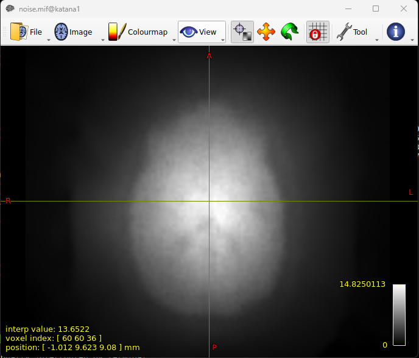
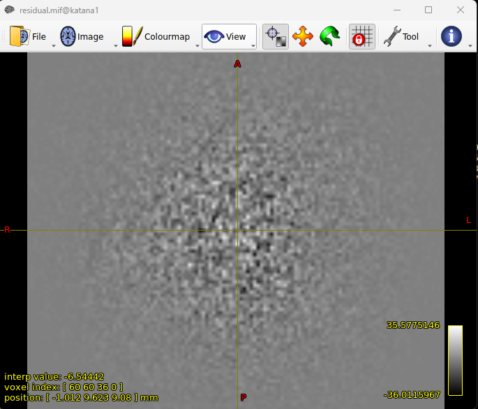
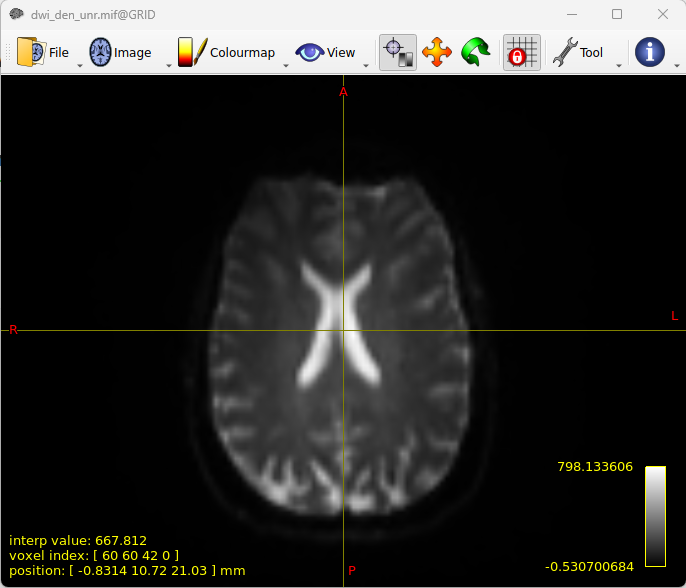
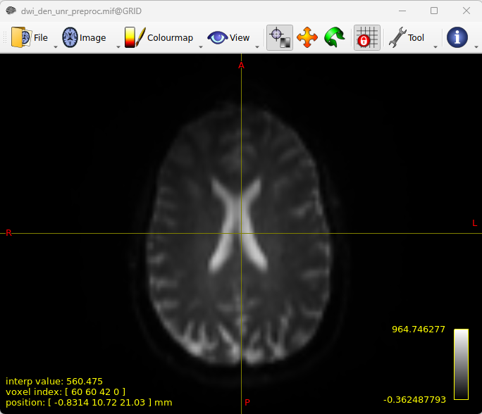
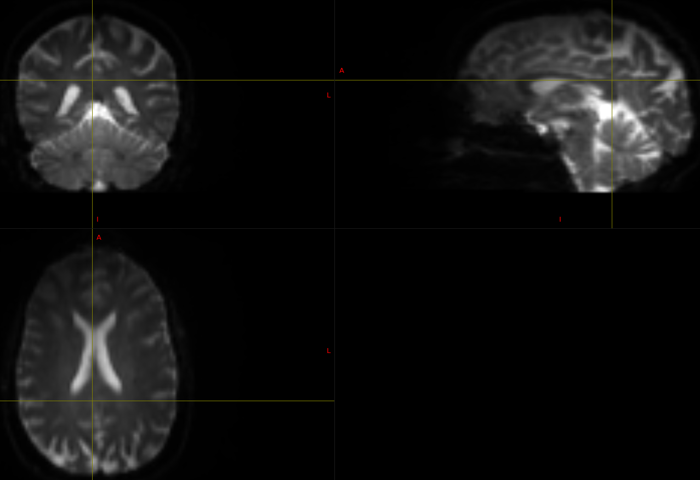

[USE THIS] Combining data of all PE's and process in one go
^^^^^^^^^^^^^^^^^^^^^^^^^^^^^^^^^^^^^^^^^^^^^^^^^^^^^^^^^^^

..  note::

	Inspired by `this MRtrix thread <https://community.mrtrix.org/t/rotating-bvecs-after-correction-for-susceptibility-induced-distortions-using-t1/2718/2>`_ (this is a very relevant example to our data), and slightly by `this thread <https://community.mrtrix.org/t/beginner-combining-two-hardi-acquisitions/1023/5>`_, we now switch to combining all DWI data, no matter it was acquired in AP or PA PE, and let MRtrix's *dwifslpreproc* to figure out everything.

[OPTION 1] Preprocessing - Convert DICOM data
~~~~~~~~~~~~~~~~~~~~~~~~~~~~~~~~~~~~~~~~~~~~~
..  _slice location error of MRtrix:

..  warning::
	
	Note that it seems DWI data transferred from scanner to Flywheel will lose some info, and are not compatible with MRtrix. Some observed issues include: 1) error of "slice position information missing from DICOM header!" when using mrconvert/mrinfo/mrcat to convert/view DICOM data downloaded from Flywheel, and 2) mif converted from data downloaded from Flywheel has more than 4 dimentions, and gives error of "contains more than 4 dimensions" when concatenate with other mif. By using mrinfo to view the header, dimension is 122 x 122 x 1 x 74 x 9, while 122 x 122 x 74 x 31 is expected. These errors led me to work around it using the following methods and data copied from scanner to a portable hard drive.

	**Update 02/08/2023:** 
		* *Email 1 from Ralf*: The files were accidentally exported using DICOM version 2 to portable hard drive. The data exported to Flywheel are DICOM verison 3, which will be consistently exported in the future.
		* *Email 2 from Ralf*: The field "SliceLocation" (0020,1041) (i.e., the field that is missing in data from Flywheel which was the reason for the error of missing slice position information when running mrconvert.) is an older field, and not supported anymore in new DICOM versions (David Clunie, the DICOM guru/boss discourages its use). It is not – and never was – well defined. Siemens used it in the past but with the introduction of ‘moving table’ they ran into trouble of it’s use. You should always calculate the position from (0020,0032). The information, however, is not lost. Siemens couldn’t quite let go of it. You can get it from the private tag: (0021,1188).
		* Need to confirm with MRtrix people. Ralf suggested siting `this <https://discourse.itk.org/t/whats-the-meaning-of-slice-location-0020-1041/4277>`_ TKL/ITK discussion where David Clunie chimed in.

Use *3D Slicer* to extract series with the following series description to a specific folder, e.g., *3DslicerExtractedDWI*.

* PA_FMAP_for DIFFUSION
* AP_FMAP_for DIFFUSION
* AP_BLOCK_1_DIFFUSION_30DIR
* AP_BLOCK_2_DIFFUSION_30DIR
* PA_BLOCK_1_DIFFUSION_30DIR
* PA_BLOCK_2_DIFFUSION_30DIR

Use the following commands to convert DICOM to MIF:

..  code-block::

	mrconvert /path/to/3DslicerExtractedDWI PA_B0.mif
	mrconvert /path/to/3DslicerExtractedDWI AP_B0.mif
	mrconvert /path/to/3DslicerExtractedDWI AP_1.mif
	mrconvert /path/to/3DslicerExtractedDWI AP_2.mif
	mrconvert /path/to/3DslicerExtractedDWI PA_1.mif
	mrconvert /path/to/3DslicerExtractedDWI PA_2.mif

Each *mrconvert* command will generate the following output in the shell:

..  code-block::

	mrconvert: [.   ] scanning DICOM folder "/srv/scrat...2pilot/3DslicerExtractedDWI"...
	mrconvert: [WARNING] mismatched series number and UID - this may cause problems with series grouping
	mrconvert: [done] scanning DICOM folder "/srv/scrat...2pilot/3DslicerExtractedDWI"
	Select series ('q' to abort):
	   0 -  240 MR images 15:50:05 PA_FMAP_for DIFFUSION (*epse2d1_86) [25001] ORIGINAL PRIMARY M ND NORM MFSPLIT
	   1 -  240 MR images 15:50:42 AP_FMAP_for DIFFUSION (*epse2d1_86) [26001] ORIGINAL PRIMARY M ND NORM MFSPLIT
	   2 - 2294 MR images 15:51:51 AP_BLOCK_1_DIFFUSION_30DIR (*ep_b0) [27001] ORIGINAL PRIMARY DIFFUSION NONE ND NORM MFSPLIT
	   3 - 2294 MR images 15:54:44 AP_BLOCK_2_DIFFUSION_30DIR (*ep_b0) [35001] ORIGINAL PRIMARY DIFFUSION NONE ND NORM MFSPLIT
	   4 - 2294 MR images 15:57:37 PA_BLOCK_1_DIFFUSION_30DIR (*ep_b0) [43001] ORIGINAL PRIMARY DIFFUSION NONE ND NORM MFSPLIT
	   5 - 2294 MR images 16:00:29 PA_BLOCK_2_DIFFUSION_30DIR (*ep_b0) [51001] ORIGINAL PRIMARY DIFFUSION NONE ND NORM MFSPLIT
	?

Select corresponding series number for the mrconvert call. For example, when converting PA_B0.mif, select 0. When converting AP_B0, select 1, and so on.

Then, concatenate all DWI data into a single file, and all additionally acquired B0's into a single file:

..  warning::

	When dwicat B0's in different PE, an error of no gradient table with B0's will raise. B0 DICOM's do not have gradient table stored. We manually add this info, i.e., all zeros. In addition, phase encoding tables are missing from mif header for both B0's and DWI. We'll also add those. For reasons why "0 -1 0 0.052" for AP and "0 1 0 0.052" for PA were set, refer to `Generating acqparam`_.

..  code-block::

	# merge DWI datasets
	dwicat AP_1.mif AP_2.mif PA_1.mif PA_2.mif dwi_noPEtab.mif
	
	# Gradient table and PE table for B0's
	echo "0 0 0 0" > tempGradTab.bvec
	echo "0 0 0 0" >> tempGradTab.bvec
	echo "0 0 0 0" >> tempGradTab.bvec

	echo "0 0 0 0" > tempGradTab.bval

	[ -f "AP_pe_table_B0" ] && rm -f AP_pe_table_B0;
	for i in {1..4};do echo "0 -1 0 0.052" >> AP_pe_table_B0;done
	[ -f "PA_pe_table_B0" ] && rm -f PA_pe_table_B0;
	for i in {1..4};do echo "0 1 0 0.052" >> PA_pe_table_B0;done

	mrconvert -fslgrad tempGradTab.bvec tempGradTab.bval -import_pe_table AP_pe_table_B0 AP_B0.mif AP_B0_wGradTab_wPEtab.mif
	mrconvert -fslgrad tempGradTab.bvec tempGradTab.bval -import_pe_table PA_pe_table_B0 PA_B0.mif PA_B0_wGradTab_wPEtab.mif

	dwicat AP_B0_wGradTab_wPEtab.mif PA_B0_wGradTab_wPEtab.mif b0.mif
	
	# PE table for DWI
	[ -f "AP_pe_table" ] && rm -f AP_pe_table;
	for i in {1..62};do echo "0 -1 0 0.052" >> AP_pe_table;done
	[ -f "PA_pe_table" ] && rm -f PA_pe_table;
	for i in {1..62};do echo "0 1 0 0.052" >> PA_pe_table;done

	cat AP_pe_table > pe_table
	cat PA_pe_table >> pe_table

	mrconvert -import_pe_table pe_table dwi_noPEtab.mif dwi.mif

`dwicat <https://mrtrix.readthedocs.io/en/dev/reference/commands/dwicat.html>`_ is used to automatically adjust for differences in intensity scaling. This is now preperred approach to concatenate data over *mrcat*.

[OPTION 2] Preprocessing - Convert DICOM data
~~~~~~~~~~~~~~~~~~~~~~~~~~~~~~~~~~~~~~~~~~~~~
I noticed the JSON files associated with NIFTI files that had been automatically exported to Flywheel, and stored in the same folder as the DOCIM files, have correct slice timing information. Therefore, the current strategy is to assemble the MIF file using those NIFTI and associated JSON files. Note that all *.nii.gz, *.bval, *.bvec, and *.json are copied from DICOM folders.

..  code-block::

	# convert DWI data
	mrconvert -json_import AP_1.json -fslgrad AP_1.bvec AP_1.bval AP_1.nii.gz AP_1.mif
	mrconvert -json_import AP_2.json -fslgrad AP_2.bvec AP_2.bval AP_2.nii.gz AP_2.mif
	mrconvert -json_import PA_1.json -fslgrad PA_1.bvec PA_1.bval PA_1.nii.gz PA_1.mif
	mrconvert -json_import PA_2.json -fslgrad PA_2.bvec PA_2.bval PA_2.nii.gz PA_2.mif
	dwicat AP_1.mif AP_2.mif PA_1.mif PA_2.mif dwi.mif

	# convert B0
	echo "0 0 0 0" > tempGradTab.bvec
	echo "0 0 0 0" >> tempGradTab.bvec
	echo "0 0 0 0" >> tempGradTab.bvec
	echo "0 0 0 0" > tempGradTab.bval
	mrconvert -fslgrad tempGradTab.bvec tempGradTab.bval -json_import AP_B0.json AP_B0.nii.gz AP_B0.mif
	mrconvert -fslgrad tempGradTab.bvec tempGradTab.bval -json_import PA_B0.json PA_B0.nii.gz PA_B0.mif
	dwicat AP_B0.mif PA_B0.mif b0.mif

Preprocessing - Denoising
~~~~~~~~~~~~~~~~~~~~~~~~~
To estimate the spatially varying noise map.

..  code-block::

	dwidenoise -nthreads 8 -force dwi.mif dwi_den.mif -noise noise.mif 

	mrcalc dwi.mif dwi_den.mif -subtract residual.mif   # calculate difference btw raw and denoised iamges
	mrview noise.mif residual.mif

Using MRView, we can visualise the noise and difference maps. Use *page up/done* key to change between the displayed images.

Preprocessing - Unringing
~~~~~~~~~~~~~~~~~~~~~~~~~
To remove Gibb's ringing artefacts.

..  code-block::

		mrdegibbs dwi_den.mif dwi_den_unr.mif -axes 0,1

		# -axes is used to inform the plane the data were acquired.
		# -axes 0,1 refers to axial slices. This is VCI/MAS2 slice direction.
		# -axes 0,2 refers to coronal slices.
		# -axes 1,2 refers to sagittal slices.

We can then calculate the difference between the denoised image and the unringed image, and visualise the images.

..  code-block::

	mrcalc dwi_den.mif dwi_den_unr.mif -subtract residual_unringed.mif
	
	mrview dwi_den_unr.mif residual_unringed.mif
	
..  image:: figures/dwi_den_unr.png
	:width: 400
..  image:: figures/residual_unringed.png
	:width: 400

Preprocessing - Motion and distortion correction
~~~~~~~~~~~~~~~~~~~~~~~~~~~~~~~~~~~~~~~~~~~~~~~~

..  note::

    Note that slice-to-volume motion correction is only available for CUDA version of eddy. Suggest running on GRID workstation at CHeBA where eddy_cuda is already configured. 

..  warning::
	
	BATMAN tutorial said that order matters here - MRtrix requires the first image to be the B0 in the PE direction of DWI data, and the last B0 is in reversed PE direction. However, in our case where we plan to ask MRtrix to read image header, I am not sure if we still have to follow this. To be safe, both B0 and DWI mif are organised in AP then PA order.

Several B0 images were acquired in both PE directions for VCI and MAS2 data, both within the DWI blocks and as separate sequences (refer to `VCI and MAS2 DWI data description`_). Here our strategy is to use the separately acquired opposing PE direction B0's to generate fieldmap to correct for EPI distortion. In MRtrix, both motion and EPI distortion corrections are carried out by using *dwifslpreproc* command, which will call FSL's *eddy*, *topup*, and *applytopup* tools. Refer to `MRtrix dwifslpreproc webpage 1 <https://mrtrix.readthedocs.io/en/3.0.4/dwi_preprocessing/dwifslpreproc.html>`_ and `2 <https://mrtrix.readthedocs.io/en/dev/reference/commands/dwifslpreproc.html>`_ for more details. We include all information (gradient table, PE table) in mif header and ask dwifslpreproc to figure out everything. This essentially follows `the 3rd example in this link <https://mrtrix.readthedocs.io/en/dev/reference/commands/dwifslpreproc.html#example-usages>`_.

* *dwi_den_unr.mif* as input, and *dwi_den_unr_preproc.mif* as output.

* *-rpe_header* option to specify that the PE information can be found in the image headers, and that this is the info that the script should use.

* *-se_epi b0.mif*: This option provides an additional image series consisting of spin-echo EPI images, which is to be used exclusively by topup for estimating the inhomogeneity field (i.e. it will not form part of the output image series)

* *-nocleanup* option will keep all intermediate files for examination. This is optional.

* *-force* to overwrite previous results.

* *-topup_options* to pass topup options. Refer to `FSL topup webpage <https://fsl.fmrib.ox.ac.uk/fsl/fslwiki/topup/TopupUsersGuide>`_ for the list of options.

  * We use default settings for topup here, without customising any options.

* *-eddy_options* to pass eddy options. eddy options that need to be specified include:

  * *--repol*: Remove any slices deemed as outliers and replace them with predictions made by the Gaussian Process. Outlier is defined by *--ol_nstd*, *--ol_nvox*, *--ol_type*, *--ol_pos*, and *--ol_sqr*. If defaults are used for those options, outliers are defined as a slice whose average intensity is at least 4 SD lower than the expected intensity, where the expectation is given by the Gaussian Process prediction. FSL group's experience and tests indicate that it is always a good idea to use *--repol* (`Reference <https://fsl.fmrib.ox.ac.uk/fsl/fslwiki/eddy/UsersGuide#A--repol>`_).

  * *--niter=8 --fwhm=10,6,4,2,0,0,0,0*: Specify 8 iterations with decreasing amounts of smooth to have better chances of convergence. This is `recommended for data with lots of movement <https://fsl.fmrib.ox.ac.uk/fsl/fslwiki/eddy/Faq#What_would_a_good_eddy_command_look_like_for_data_with_lots_of_movement.3F>`_. Another, more general, `recommendation <https://fsl.fmrib.ox.ac.uk/fsl/fslwiki/eddy/UsersGuide/#A--niter>`_ is to have 5 iterations with *--fwhm=10,0,0,0,0*. It means that the first iteration is run with a FWHM of 10mm, which helps that algorithm to take a big step towards the true solution. The remaining iterations are run with a FWHM of 0mm, which offers high accuracy. This was found to work well in most cases. But on he safe side, we chose the previous, more time-consuming but more accurate, option.

  * *--slspec=my_slspec.txt*: slspec file should look like `this <https://fsl.fmrib.ox.ac.uk/fsl/fslwiki/eddy/UsersGuide#A--slspec>`_, and there is `a script <https://fsl.fmrib.ox.ac.uk/fsl/fslwiki/eddy/Faq#How_should_my_--slspec_file_look.3F>`_ to automatically generate this file. The same script is copied below. SPM also offers scripts and some good explanations on slice timing info (`link <https://en.wikibooks.org/w/index.php?title=SPM/Slice_Timing#Slice_Order>`_). Other readings include `this <https://practicalfmri.blogspot.com/2012/07/siemens-slice-ordering.html>`_. **Note** that *dwifslpreproc* requires *my_slspec.txt* to be passed to command through *--eddy_slspec*, instead of *--eddy_opions "--slspec=..."*

  ..  code-block::

	fp = fopen('AP_1.json','r');
	fcont = fread(fp);
	fclose(fp);
	cfcont = char(fcont');
	i1 = strfind(cfcont,'SliceTiming');
	i2 = strfind(cfcont(i1:end),'[');
	i3 = strfind(cfcont((i1+i2):end),']');
	cslicetimes = cfcont((i1+i2+1):(i1+i2+i3-2));
	slicetimes = textscan(cslicetimes,'%f','Delimiter',',');
	[sortedslicetimes,sindx] = sort(slicetimes{1});
	mb = length(sortedslicetimes)/(sum(diff(sortedslicetimes)~=0)+1);
	slspec = reshape(sindx,[mb length(sindx)/mb])'-1;
	dlmwrite('my_slspec.txt',slspec,'delimiter',' ','precision','%3d');

  The resultant slice order should look like:

  ..  code-block::

	0  37
	2  39
	4  41
	6  43
	8  45
	10  47
	12  49
	14  51
	16  53
	18  55
	20  57
	22  59
	24  61
	26  63
	28  65
	30  67
	32  69
	34  71
	36  73
	1  38
	3  40
	5  42
	7  44
	9  46
	11  48
	13  50
	15  52
	17  54
	19  56
	21  58
	23  60
	25  62
	27  64
	29  66
	31  68
	33  70
	35  72

  ..  warning::

	Although the protocol and the *MultibandAccelerationFactor* field of json file indicate that a multi-band factor of 2 was applied, *SliceTiming* recorded in DICOM/json seems to indicate it was an interleaved acquisition without simultaneous multi-slices.

	**Old solusion**: We presume the *SliceTiming* field gives accurate data, i.e., data were acquired in an interleaved manner without simultaneous multi-slices. We still supply the *my_slspec.txt* file generated by the above code, although it will be a single column indicating slice order (i.e., single band). We also set *--ol_type* option to *both*, although there's only a single multi-band group. In the future, if multi-band is confirmed, simply replace the my_slspec.txt file to reflect this, and other parts do not need to be changed. However, note that *--mporder* value needs to be changed if multi-band is confirmed.

	**13/08/2023 update**: I noticed that the NIFTI data automatically converted when exporting from scanner to Flywheel, and stored in the same folder as DICOM files contains the correct slice timing (multi-band factor = 2). See *my_slspec.txt* generated above.

  * *--ol_type=both*: This option defines how outliers are assessed. *both* means that the program will consider an multi-band group as the unit, but additionally looks for slice-wise outliers. This is to find single slices within a group that has been affected by pulsatile movement not affecting the other slices.

  * *--mporder=10*: This option is related to slice-to-volume motion correction. Since this correction is time-consuming, it is `recommended <https://fsl.fmrib.ox.ac.uk/fsl/fslwiki/eddy/UsersGuide#A--mporder>`_ to set the value in the range of N/4 to N/2, where N is the number of excitations per volume. The number of excitations is equivalent to number of slices for single band data, and should divide by multi-band factor for multi-band data. For example an MB/SMS factor of 3 means that you acquired 3 slices for each excitation. If you for example have 63 slices and an MB/SMS factor of 3 it means that you have 21 excitations (`Reference <https://www.jiscmail.ac.uk/cgi-bin/wa-jisc.exe?A2=ind1712&L=FSL&P=R34891>`_). Since we have 74 slices and multiband factor of 2, this value is now set to 10.

  * *--s2v_niter=8*: This option defines number of iterations for estimating slice-to-volume movement parameters. 5-10 iterations gives good results, with small advantage of 10 over 5. Slice-to-volume is time-consuming.

  * *--s2v_lambda=5*: This option determines the strength of temporal regularisation of the estimated movement parameters. This is especially important for single-band data with "empty" slices at the top/bottom of the FOV. Values in the range 1--10 give good results.

  * *--s2v_interp=trilinear*: This option determines the interpolation model in the slice-direction for the estimation of the slice-to-volume movement parameters. *spline* is theoretically a better interpolation method. However, little advantage is observed during tests conducted by FSL group. Therefore, *trilinear* is recommanded. For the final re-sampling, spline is always used regardless of how --s2v_interp is set.

  * *--data_is_shelled*: By default, *eddy* will check input data is single- or multi-shell diffusion data, i.e., not diffusion spectrum imaging data. The checking is performed through a set of heuristics such as i) how many shells are there? ii) what are the absolute numbers of directions for each shell? iii) what are the relative numbers of directions for each shell? etc. It will for example be suspicious of too many shells, too few directions for one of the shells etc. It has emerged that some popular schemes get caught in this test. Some groups will for example acquire a "mini shell" with low b-value and few directions and that has failed to pass the "check", even though it turns out eddy works perfectly well on the data. For VCI and MAS2 data, there are a small number of volumes acquired at B1=1950 or B1=2950. Therefore, to prevent eddy from failing, *--data_is_shelled* flag is set.

  * *--flm=quadratic*: This option specifies how complicated we believe the eddy current-induced fields may be. Possible inputs include *linear*, *quadratic*, and *cubic*. *linear* and *quadratic* were found to be successful in most cases. HCP data requires *quadratic*. Some more explanations are `here <https://fsl.fmrib.ox.ac.uk/fsl/fslwiki/eddy/UsersGuide#A--flm>`_.

  * *--slm=linear*: This second level model (slm) specifies the mathematical form for how the diffusion gradients cause eddy currents. For high quality data with 60 directions, or more, sampled on the whole sphere FSL group did not find any advantage of performing second level modelling. Hence recommendation for such data is to use none, and that is also the default. If the data has quite few directions and/or it has not been sampled on the whole sphere it can be advantageous to specify *--slm=linear*. Since VCI and MAS2 data did not semple low B1 shells very well (see figure below. The code to generate the figure follows.), we use *--slm=linear* option.

  ..  image:: figures/dwi_gradients.png
      :width: 600

  ..  code-block::

	bvec_AP1 = load('AP_1.bvec');
	bval_AP1 = load('AP_1.bval');
	bvec_AP2 = load('AP_2.bvec');
	bval_AP2 = load('AP_2.bval');
	bvec_PA1 = load('PA_1.bvec');
	bval_PA1 = load('PA_1.bval');
	bvec_PA2 = load('PA_2.bvec');
	bval_PA2 = load('PA_2.bval');

	bvecs = [bvec_AP1 bvec_AP2 bvec_PA1 bvec_PA2];
	bvals = [bval_AP1 bval_AP2 bval_PA1 bval_PA2];
	bvecs_bvals = [bvecs;bvals];

	bvecs_B1000 = bvecs_bvals(1:3, bvecs_bvals(4,:)==1000);
	bvecs_B2000 = bvecs_bvals(1:3, bvecs_bvals(4,:)==2000 | bvecs_bvals(4,:)==1950);
	bvecs_B3000 = bvecs_bvals(1:3, bvecs_bvals(4,:)==3000 | bvecs_bvals(4,:)==2950);

	t = tiledlayout (2,2);
	
	nexttile
	plot3(bvecs_B1000(1,:),bvecs_B1000(2,:),bvecs_B1000(3,:),'*r');
	title('B1000');
	axis([-1 1 -1 1 -1 1]);
	axis vis3d;
	rotate3d;

	nexttile
	plot3(bvecs_B2000(1,:),bvecs_B2000(2,:),bvecs_B2000(3,:),'*r');
	title('B2000');
	axis([-1 1 -1 1 -1 1]);
	axis vis3d;
	rotate3d;

	nexttile
	plot3(bvecs_B3000(1,:),bvecs_B3000(2,:),bvecs_B3000(3,:),'*r');
	title('B3000');
	axis([-1 1 -1 1 -1 1]);
	axis vis3d;
	rotate3d;

  * *--estimate_move_by_susceptibility*: Specifies that eddy shall attempt to estimate how the susceptibility-induced field changes when the subject moves in the scanner. FSL recommends it is used when scanning populations that move "more than average", such as babies, children or other subjects that have difficulty remaining still. It can also be needed for studies with long total scan times, such that even in corporative subjects the total range of movement can become big.

  * *--cnr_maps*: This will generate *my_eddy_output.eddy_cnr_maps*. This is a 4D image file with N+1 volumes where N is the number of non-zero b-value shells. The first volume contains the voxelwise SNR for the b=0 shell and the remaining volumes contain the voxelwise CNR (Contrast to Noise Ratio) for the non-zero b-shells in order of ascending b-value. For example if your data consists of 5 b=0, 48 b=1000 and 64 b=2000 volumes, my_eddy_output.eddy_cnr_maps will have three volumes where the first is the SNR for the b=0 volumes, followed by CNR maps for b=1000 and b=2000. The SNR for the b=0 shell is defined as mean(b0)/std(b0). The CNR for the DWI shells is defined as std(GP)/std(res) where std is the standard deviation of the Gaussian Process (GP) predictions and std(res) is the standard deviation of the residuals (the difference between the observations and the GP predictions). The my_eddy_output.eddy_cnr_maps can be useful for assessing the overall quality of the data.

..  note::
	
	Note that *-align_seepi* option is advocated, to ensure the 1st volume in the series provided to top up is also the 1st volume in series provided to eddy, guaranteeing alignment. However, this requires the image contrast of the opposing PE B0's provided to -se_epi option matching B0 volumes in the input DWI series, meaning equivalent TR, TE, and flip angle (also note that multi-band factors between two images may lead to differences in TR). However, this is not the case in VCI/MAS2. Therefore, discarding *-align_seepi*.

* The final *dwifslpreproc* reads as follow:

  ..  code-block::

	mkdir eddy_QC

	dwifslpreproc dwi_den_unr.mif dwi_den_unr_preproc.mif -nthreads 40 -force -rpe_header -se_epi b0.mif -eddyqc_all eddy_QC -nocleanup -eddy_slspec my_slspec.txt -eddy_options " --repol --niter=8 --fwhm==10,6,4,2,0,0,0,0 --ol_type=both --mporder=10 --s2v_niter=8 --s2v_lambda=5 --s2v_interp=trilinear --data_is_shelled --flm=quadratic --slm=linear --estimate_move_by_susceptibility --cnr_maps"

	*AP before dwifslpreproc*

	*AP after dwifslpreproc*

	*PA before dwifslpreproc*

..  figure:: figures/PA_after_dwifslpreproc.png
	:width: 400

	*PA after dwifslpreproc*

Preprocessing - Bias field correction
~~~~~~~~~~~~~~~~~~~~~~~~~~~~~~~~~~~~~
This step performed bias field correction, aiming at improving the following brain mask estimation. However, if no strong bias fields are present in data, running this step will deteriorate brain mask estimation and result in inferior brain mask estimation. *Brain masks should be checked to decide whether this step should be included in the pipeline*. Note that the *ants* option is recommended by BATMAN tutorial for *dwibiascorrect*, and for this, ANTs needs to be installed.

..  code-block::

	dwibiascorrect ants dwi_den_unr_preproc.mif dwi_den_unr_preproc_unbiased.mif -bias bias.mif

Preprocessing - Brain mask estimation
~~~~~~~~~~~~~~~~~~~~~~~~~~~~~~~~~~~~~
This step will create a binary mask of brain. Downstream analyses will be performed within the mask to improve biological plausibility of streamlines and reduce computation time. Here, we also compare masks derived from *bias-corrected* and *non-bias-corrected* data.

..  code-block::

	dwi2mask dwi_den_unr_preproc_unbiased.mif mask_den_unr_preproc_unb.mif  # mask from bias-corrected.
	dwi2mask dwi_den_unr_preproc.mif mask_den_unr_preproc.mif               # mask from non-bias-corrected.

	mrview dwi_den_unr_preproc.mif -overlay.load mask_den_unr_preproc_unb.mif

	*DWI data.*

..  figure:: figures/mask_unbiased.png
	:width: 400

	*Mask after bias correction (mask in red superimposed onto DWI).*

..  figure:: figures/mask_non-unbiased.png
	:width: 400

	*Mask without running bais correction (mask in red superimposed onto DWI).*

We can see that the mask with bias-correction looks better. It is always a good idea to visualise the genrated mask.

Now, we finish preprocessing steps, and are ready for post-processing, e.g., creating streamlines.

