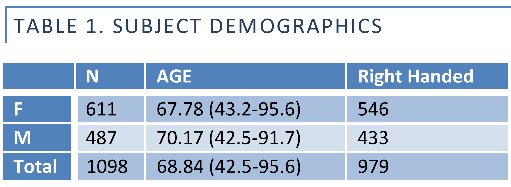

OASIS 3 sample charateristics
=============================

* 609 cognitive normal + 489 at various stages of cognitive decline.
* 42-95 yo.
* 2000 MR sessions, incld *T1w, T2w, FLAIR, ASL, SWI, ToF, rs-BOLD, DWI*.
* FreeSurfer processing applied.
* PET with 3 tracers, PiB, AV45, and FDG.
* 1500 raw PET images, and post-processed with Pet Unified Pipeline (PUP).

*Sample demographics*

*Clinical dementia rating*